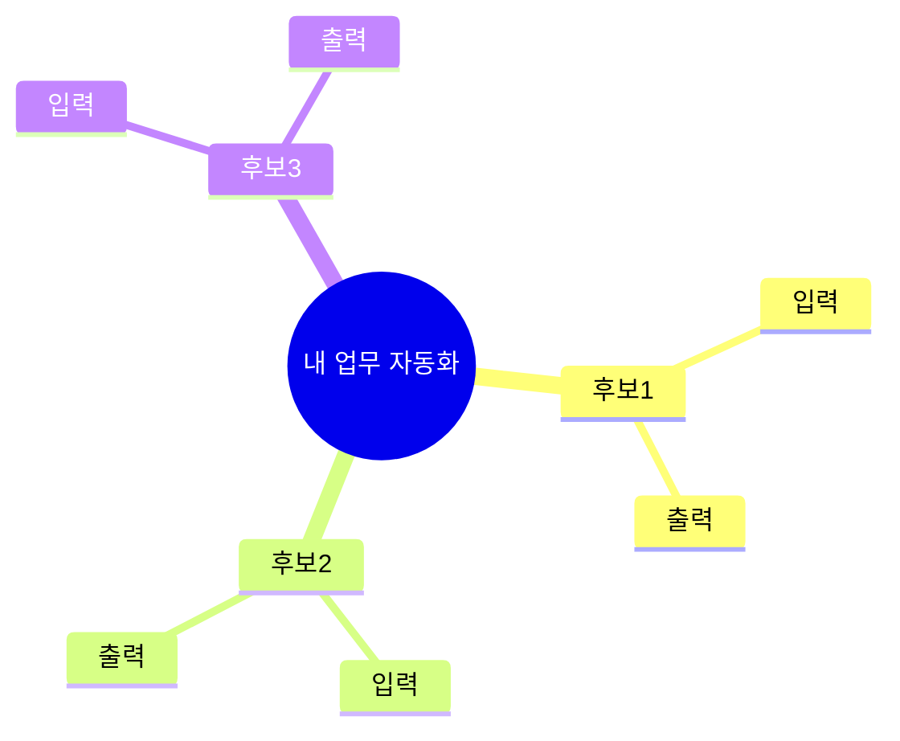

# 02 — AI 활용 2차 TF 2회차 설계 분석 (확정안)

> 이 파일의 역할: 사용자 확정 답변(A~E)을 반영한 2회차 설계 정본.  
> 1회차(`Cursor/01_session-01-content.md`)는 **수정하지 않음**. 본 문서 → `02_session-02-content.md` → 별도 repo Slidev 순으로 진행.

작성일: 2026-05-26  
대상: 관리부서 AI 활용 2차 TF (10명 / 3회차 중 2회차)  
일시: **2026-06-02 (화) 14:00 ~ 17:00** (1회차와 동일)  
배포: **별도 GitHub repo + GitHub Pages** (1회차 repo와 분리)

---

## 1. 사용자 확정 사항 요약

| 항목 | 확정 내용 |
|------|-----------|
| **A-1 시나리오** | **새 시enario** — 강사(본 문서)가 설계. 1회차(회의록·휴가)와 분리 |
| **A-2 Mermaid** | **B안** — flowchart 집중 + mindmap 보조 |
| **A-3 흡수 범위** | 2회차에 **업무 흐름도 + micro-tool-interviewer**까지 실행. 산출: Mermaid 흐름도 · HTML 도구 사양서 |
| **A-4 난이도** | 1회차와 동일. 위원들이 잘 따라옴 → 복습 최소(5분), 실습 밀도 유지 |
| **B-2 Forms** | **Google Forms 없음** — 슬라이드·본문에서 제출 폼 링크 **전부 삭제** |
| **B-3 도구** | `mermaid.live` 포함 (markdownlivepreview는 1회차 복습용으로만 언급 가능) |
| **B-4 문의** | 1회차와 동일 — 정보시스템실 상시 문의 채널 |
| **B-5 repo** | **별도 repo, 2단계** (§5 참조) |
| **C demo-data** | **전부 강사(사용자) 작성**. AI는 파일 목록·규격·슬라이드 연결만 설계 |
| **D 1회차** | **건드리지 않음** |
| **E-1 핸드아웃** | A4 2장 필요 (부록으로 설계) |
| **E-2 아이스브레이커** | §3 — **Draw Toast** 원형 (토스트 만드는 법) |
| **E-3 화면 스케치** | 슬라이드에 **종이/태블릿 손그림 예시 1장** + 워크시트 칸 (강사 설계) |
| **E-4 HTML 미리보기** | 2회차 목표에 맞는 **교육용 placeholder** → 추후 **교육생 HTML**로 교체 |

---

## 2. 2회차 대표 시나리오 — 「출장비 정산」

### 2.1 선정 이유

| 기준 | 출장비 정산 |
|------|------------|
| 1회차와 차별 | 회의록·휴가와 무관한 **총무·재무 친화** 업무 |
| Mermaid 적합 | 산출물↔프로세스 **교대**가 자연스러움 (외부 `diagram-spec` 예시와 동형) |
| mindmap 연결 | 「정산에 필요한 서류」「비용 항목」브레인스토밍 |
| micro-tool 연결 | **「정산서 작성」** 프로세스 1개 → Session 3 HTML 도구화 명확 |
| 가공 용이 | 금액·일자·인명 → (주)멋진엔지니어링 더미로 치환 |

### 2.2 시나리오 한 줄

> **(주)멋진엔지니어링** 관리부 직원이 출장 후 **영수증·교통비·출장계획서**를 모아 **출장 정산서**를 작성·제출하는 흐름.

### 2.3 강사 시연용 흐름도 (diagram-spec 준수, 12노드)

```
flowchart TD
    출장규정[("출장 규정")]
    출장계획서[("출장 계획서")]
    출장승인[["출장 승인"]]:::proc
    승인서[("출장 승인서")]
    출장수행[["출장 수행"]]:::proc
    영수증[("영수증·교통비 증빙")]
    정산작성[["정산서 작성"]]:::proc
    정산서[("출장 정산서")]
    정산검토[["정산 검토·결재"]]:::proc
    정산보고[("정산 완료 보고")]

    출장계획서 --> 출장승인 --> 승인서
    승인서 --> 출장수행 --> 영수증
    영수증 --> 정산작성 --> 정산서
    정산서 --> 정산검토 --> 정산보고

    출장규정 -.-> 출장승인
    출장계획서 -.-> 정산작성
    출장규정 -.-> 정산검토

    classDef proc fill:#e1f5fe,stroke:#01579b,stroke-width:2px,color:#000
```

**Session 3 도구 후보 (micro-tool)**: `정산서 작성` 프로세스  
- 입력: 영수증 목록(CSV/텍스트) + 출장계획서(참조)  
- 출력: 회사 양식에 맞는 출장 정산서(텍스트/표)

### 2.4 mindmap 실습 주제 (B안)

1회차 **자동화 후보 3개**를 mindmap으로 펼치기:



→ 2회차 후반 **「후보 3개 중 1개 선택」** 으로 자연 연결.

### 2.5 1회차 시나리오와의 관계

- **회의록_정리.md**, **휴가신청_50건** — 2회차 본문에서 **주 시연으로 사용하지 않음**
- 1회차 복습(5분)에서만 「MD 프롬프트 파일」「후보 3개」 언급
- demo-data 1회차 파일은 **재활용 가능**(선택)하나 서사는 출장비 정산으로 통일

---

## 3. 아이스브레이커 설계 (E-2) — **Draw Toast** (확정)

> **확정**: [Draw Toast (Gamestorming)](https://gamestorming.com/draw-toast/) **원형** — 주제 「토스트 만드는 법」. 출장 정산 변형 ❌.  
> 본문 상세: `Cursor/02_session-02-content.md` Part 1.

### 3.1 이 게임을 하는 진짜 이유 (교육생용 쉬운 말)

**한 줄 요약**

> *"겉으로는 똑같은 말을 해도 머릿속 생각은 다르니, 복잡한 일 전에 그림으로 꺼내 놓고 **싱크** 맞추자!"*

| 목적 | 쉬운 설명 | 2회차 연결 |
|------|-----------|-----------|
| **① 같은 말, 다른 생각** | "토스트?" 다 안다 해도 A(토스터)·B(프라이팬)·C(밀밭~) 그림이 갈림 | 오후 **업무 흐름도**도 사람마다 다름 |
| **② 두뇌 스트레칭** | Mermaid·도구 같은 어려운 주제 **전** 손·대화 워밍업 | 1회차 AI 퀴즈와 **대비** (손그림 중심) |
| **③ 박스·화살표 맛보기** | 식빵·토스터·손·잼을 **선으로 연결** | `diagram-spec` · Mermaid flowchart |

**슬라이드에서 쓰지 않을 말**: "디자인 씽킹", "시스템 사고" — 내부 참고만.

### 3.2 게임 방법 (15분)

| 단계 | 시간 | 내용 |
|------|------|------|
| ① 준비 | 1분 | A4·펜(포스트잇) 나눠 주기 |
| ② 그리기 | 2~3분 | **말·글자 금지**, 「토스트 만드는 법」**그림만** |
| ③ 붙이고 비교 | 4~5분 | 벽/책상에 쭉 붙여 **전체 구경** |
| ④ 이야기 | 4~5분 | 유형 차이 관찰 (토스터 vs 프라이팬 vs 밀밭) |
| ⑤ 연결 | 1분 | "오후엔 **업무**를 Mermaid로" — **AI 시연은 Part 2에서** |

**규칙**: ChatGPT/Gemini **금지** · 미술 실력 무관 · 비판 금지

### 3.3 슬라이드 (4~5장)

1. 왜 토스트? (목적 ①②)  
2. 규칙  
3. 진행 단계  
4. A/B/C 유형 예시 (텍스트)  
5. 오늘과의 연결  

### 3.4 강사 준비물

- [ ] A4 또는 포스트잇 **11매**, 펜, 마스킹테이프, 타이머  
- [ ] (선택) 강사 견본 토스트 낙서 1장  

### 3.5 Mermaid와의 관계

- Draw Toast **도중** AI/Mermaid 시연 **하지 않음**  
- Part 2 첫 슬라이드: *"아까 토스트 기억나죠? 이제 텍스트로 그립니다"*

---

## 4. 2회차 콘텐츠 골격 (슬라이드·본문 Part 구조)

### 4.1 도달 상태 (2회차 종료 시)

1. **Mermaid flowchart**로 본인 업무 흐름도 1장 작성 가능  
2. **mindmap**으로 자동화 후보 3개를 구조화 가능  
3. 프롬프트 **3요소**(Input / Instruction / Output) 구분 가능  
4. **micro-tool-interviewer**로 **HTML 도구 사양서** 초안 1건 확보  
5. Session 3에서 코딩만 남도록 **입·출력·화면**이 문서화됨  

### 4.2 시간표 (180분)

| 교시 | 시간 | Part | 핵심 | 실습 |
|------|------|------|------|------|
| **1교시** | 50분 | 0 복습 5분 + 1 아이스브레이커 + 2 Mermaid 입문 | flowchart, mermaid.live | 연습 ① flowchart (15분) |
| ☕ | 10분 | | | |
| **2교시** | 50분 | 3 mindmap + 4 diagram-spec + 5 업무 흐름도 | 규격 첨부 프롬프트 | 연습 ② mindmap + 흐름도 초안 (30분) |
| ☕ | 10분 | | | |
| **3교시** | 50분 | 6 프롬프트 3요소 + 7 micro-tool-interviewer | 도구 1개 확정 | 인터뷰 + 스케치 (35분) |
| **마무리** | 10분 | 8 정리·과제·3회차 예고 | Forms **없음** | |

실습 비중: **약 80분 (44%)** — 운영 계획 「50%」에 근접.

### 4.3 Part별 슬라이드 예상 (약 58~62장)

| Part | 제목 | 장수 | 비고 |
|------|------|------|------|
| 0 | 1회차 복습 + 2회차 로드맵 | 7 | Forms 언급 없음 |
| 1 | 아이스브레이커 (Draw Toast) | 4~5 | §3 |
| 2 | Mermaid + flowchart + mermaid.live | 10 | B안: flowchart 중심 |
| 3 | mindmap + 후보 3개 구조화 | 5 | |
| 4 | diagram-spec + 출장 정산 견본 | 8 | **2회차 클라이맥스 ①** |
| 5 | 본인 업무 흐름도 실습 | 4 | |
| 6 | 프롬프트 3요소 | 6 | 1회차 MD 6칸과 연결 |
| 7 | micro-tool-interviewer + 화면 스케치 | 8 | **2회차 클라이맥스 ②** |
| 8 | 정리·과제·3회차 예고 | 4 | |
| 교시/휴식 | section + break | 5 | 1회차 패턴 동일 |
| **합계** | | **~60** | |

### 4.4 Session 03 흡수 범위 (2회차에서 **제외**)

- PROMPT.txt **전체** 반복 개선 사이클 → **3회차**  
- `prompt-refine-coach` → **3회차**  
- 2회차에는 「3요소」+ 「micro-tool 사양서」까지만  

---

## 5. 별도 repo 2단계 계획 (B-5)

### 5.1 왜 2단계인가

- **1단계**: 1회차 repo(`yooshin-ai-tf-2026`) **무손상** — Pages URL 유지  
- **2단계**: 2회차 전용 repo — 독립 배포·버전·`exportFilename`  

### 5.2 1단계 — 로컬 스캐폴드 (AI/강사 작업)

```
AI Education/
├── ppt/                          ← 1회차 (수정 금지)
├── ppt-session-02/               ← 2회차 Slidev (신규)
│   ├── slides.md
│   ├── nav-config.js
│   ├── style.css                 ← 1회차에서 복사
│   ├── package.json              ← title/exportFilename만 변경
│   ├── components/SlideNav.vue
│   ├── global-top.vue
│   └── public/
│       ├── fonts/
│       ├── cover-ai-native.jpg
│       └── tools/                ← E-4 placeholder → 추후 교육생 HTML
├── demo-data-session-02/           ← 2회차 demo (강사 작성, C)
│   └── README.md                 ← 파일 목록만 AI가 먼저 작성
└── Cursor/
    ├── 02_session-02-analysis.md   ← 본 파일
    └── 02_session-02-content.md    ← 다음 단계
```

### 5.3 2단계 — GitHub repo 생성·배포 (강사 실행)

| 순서 | 작업 |
|------|------|
| 1 | GitHub에서 **새 Public repo** 생성 (예: `yooshin-ai-tf-2026-session-02`) |
| 2 | `ppt-session-02/` + `demo-data-session-02/` + `Cursor/02_*` + README 복사 |
| 3 | `.github/workflows/deploy.yml` — `working-directory: ppt-session-02` |
| 4 | `npm install && npm run build` 로컬 검증 |
| 5 | push → Pages URL 활성화 (예: `https://baikhojun.github.io/yooshin-ai-tf-2026-session-02/`) |

**1회차 README** 하단에 2회차 링크 1줄 추가는 **선택**(1회차 repo 수정 최소화 원칙 — 강사 판단).

---

## 6. demo-data-session-02 — 강사 작성 체크리스트 (C)

> AI는 **본문·슬라이드에 연결점만** 명시. 파일 **내용은 강사 작성**.

| 파일 (가칭) | 용도 | Part |
|-------------|------|------|
| `업무흐름도_규격.md` | diagram-spec 한국어·출장 정산 예 | 4 |
| `mermaid_예제_flowchart.md` | 연습 ① | 2 |
| `mermaid_예제_mindmap.md` | 연습 ② | 3 |
| `출장정산_흐름도_견본.md` | 강사 라이브 시연 | 4 |
| `출장정산_입력샘플/` | 영수증.txt, 출장계획서.md (가공) | 4, 7 |
| `micro-tool-interviewer.md` | 1차 강사 자료 기반 또는 repo 복사 | 7 |
| `도구사양서_견본.md` | micro-tool 결과 예시 | 7 |
| `도구컨셉_워크시트.md` | 화면 스케치 + 3요소 칸 | 7 |
| `프롬프트_3요소_분해예시.md` | 출장 정산 MD를 I/O/Instruct 분해 | 6 |
| `빈_흐름도_템플릿.md` | 위원 실습용 | 5 |

**테스트 요청 시**: 강사가 파일 초안 작성 후 AI에게 「mermaid.live 렌더 검증」「micro-tool 프롬프트 1턴 시뮬」 요청.

---

## 7. Google Forms 제거 정책 (B-2)

2회차 슬라이드·본문·과제 안내에서 **전부 삭제**:

- ❌ `forms.gle` 링크  
- ❌ 「Google Forms 제출」 문구  

**대체 제출 방식 (슬라이드에 명시)**

| 과제 | 제출 |
|------|------|
| 1→2 (이미 지남) | — |
| 2회차 실습 | **당일 수업 중** 흐름도·사양서 초안 |
| 2→3 과제 | **정보시스템실 상시 문의 채널**로 파일 공유 (메일/Teams 등 — 1회차와 동일 채널명) |

과제 ② (2→3): 확정 도구 **입·출력을 실제 업무 데이터로 ChatGPT 완전 시뮬레이션** — `교육 운영 계획.md` 3.2 라. 유지.

---

## 8. E-4 HTML 미리보기 (표지 로드맵)

1회차: `01-chaksu.html` 등 6종 → **2회차 placeholder** (관리부·출장·정산·흐름도 연상):

| placeholder | 설명 | 추후 |
|-------------|------|------|
| `01-expense-calc.html` | 출장비 항목 합산 | 교육생 HTML #1 |
| `02-receipt-parser.html` | 영수증 텍스트 정리 | 교육생 HTML #2 |
| … | 최대 6칸 | 1회차 교육생 결과물로 **교체** |

**현재 단계**: 슬라이드에 **링크 칸 + 가공 데모 1~2개**만. 전체 6종은 강사·교육생 산출 후 반영.

---

## 9. 핸드아웃 (E-1) — A4 2장 구성

**앞면**

- 2회차 목표 4줄  
- Mermaid flowchart **핵심 문법 5줄** (`flowchart TD`, `-->`, `[("")]`, `[[]]`, `classDef`)  
- mindmap **한 블록 예시**  
- diagram-spec **노드 2종 + 화살표 2종** 표  

**뒷면**

- 본인 업무 흐름도 **빈 칸** (손그림용)  
- micro-tool **사양서 목차** (개요/입력/처리/출력/UI/예외)  
- 화면 스케치 **4칸** (입력 화면 / 결과 화면 / 버튼 / 파일 업로드)  
- 2→3 과제 체크리스트 (Forms 없음)  

---

## 10. 다음 작업 순서 (승인 후)

1. ⏭ **`Cursor/02_session-02-content.md`** — Part 0~8 본문 MD (1회차 `01_session-01-content.md` 형식)  
2. ⏭ **`ppt-session-02/`** 스캐폴드 — 1회차에서 style·components·fonts **복사만**  
3. ⏭ **`slides.md` + `nav-config.js`** — 본문 변환  
4. ⏭ **`demo-data-session-02/README.md`** — 강사 체크리스트 (§6)  
5. ⏭ 강사 demo-data 작성 → AI 샘플 테스트 (요청 시)  
6. ⏭ GitHub repo 2단계 push (강사)  

---

## 11. 확인 불필요 — 이미 확정된 항목

- 회사명: **(주)멋진엔지니어링**  
- 난이도: 1회차 동일  
- micro-tool-interviewer: **2회차 3교시 필수 실행**  
- 1회차 repo: **수정하지 않음**  

---

## 12. 결론 (한 줄)

> **2회차 = 출장비 정산 시나리오 + Draw Toast 아이스브레이커 + Mermaid(flowchart·mindmap) + diagram-spec 흐름도 + micro-tool-interviewer로 HTML 도구 사양서까지 — 별도 repo `ppt-session-02/`에 1회차와 동일 Slidev 양식으로 제작, Google Forms 없음.**

본문 초안은 `Cursor/02_session-02-content.md`에서 이어서 작성.
