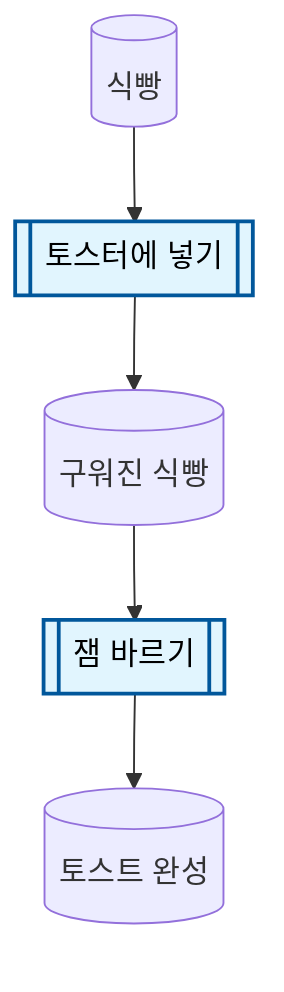

# Mermaid flowchart 예제 — 토스트 (실습 ①)

[mermaid.live](https://mermaid.live/)에 아래 코드를 붙여 넣으세요.

```mermaid
flowchart TD
    식빵[("식빵")]
    토스터[["토스터에 넣기"]]:::proc
    굽기[("구워진 식빵")]
    잼[["잼 바르기"]]:::proc
    완성[("토스트 완성")]

    식빵 --> 토스터 --> 굽기 --> 잼 --> 완성

    classDef proc fill:#e1f5fe,stroke:#01579b,stroke-width:2px,color:#000
```

## 연습

- `잼` 대신 `버터` 프로세스 추가
- `flowchart LR` 로 바꿔 보기 (왼→오)
