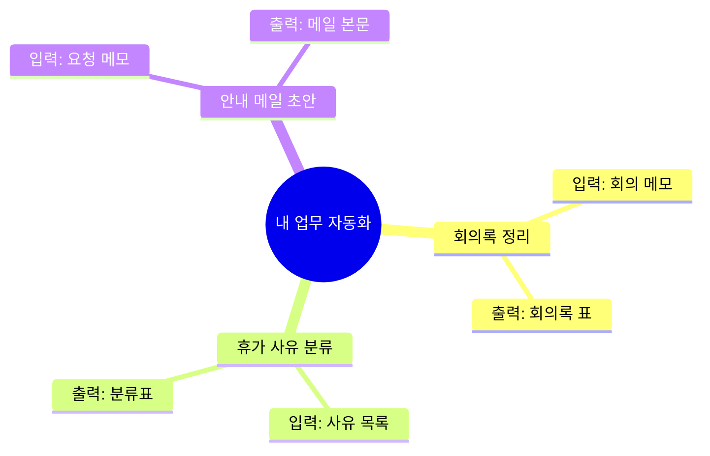

# Mermaid mindmap 예제 — 자동화 후보 3개 (실습 ②)

```mermaid
mindmap
  root((내 업무 자동화))
    회의록 정리
      입력: 회의 메모
      출력: 회의록 표
    휴가 사유 분류
      입력: 사유 목록
      출력: 분류표
    안내 메일 초안
      입력: 요청 메모
      출력: 메일 본문
```

## 연습

- 1회차 **본인 후보 3개** 이름으로 바꾸기
- 각 후보 아래 **입력 / 출력** 한 줄씩
