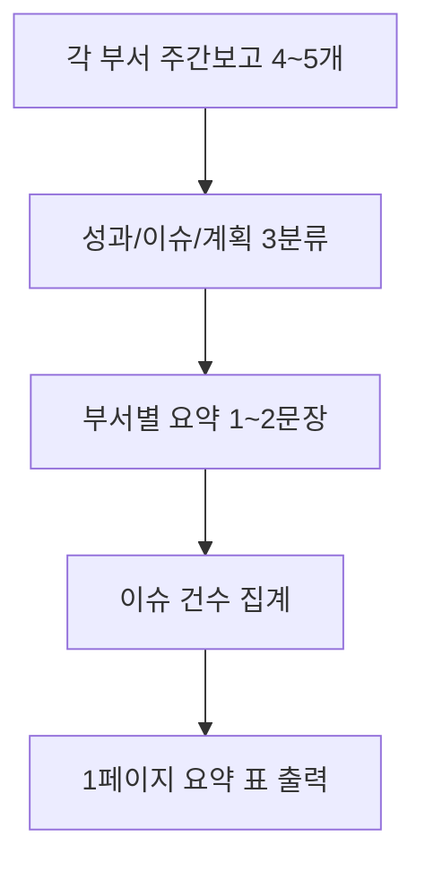

# 🏢 기획실 — 사장단 주간보고 요약

> 5차 커리큘럼 4부서 시나리오 카드 (2/4)
> 2회차 3교시 v1 예시 · 3회차 v2 예시 통합본

---

## 시나리오 한 줄

> **(주)멋진엔지니어링** 기획실 담당자가 각 부서에서 올라온 주간 업무보고서 4~5개를 받아 사장단 보고용 1페이지로 요약하는 업무.

## 빈도·소요시간

- **빈도**: 매주 1회 (월요일 오전)
- **소요시간**: 평균 2시간 (부서 5개 × 20분 평균)
- **자동화 적합도**: ⭐⭐⭐⭐ (반복·양식고정·입력은 다양하지만 출력 패턴 동일)

---

## 입력 예시 (가공 데이터)

```
[마케팅팀]
5월 셋째 주: 신제품 광고안 3종 작성 완료, 검토 회의 일정 미정으로 다음 주 진행 예정.
이슈: 광고 모델 섭외 지연 (1건)

[기술팀]
모바일 앱 v2.1 베타 출시 (5/15). 사용자 피드백 247건 수집.
이슈: iOS 인앱결제 모듈 충돌 (긴급), Android는 정상.
다음 주: iOS 핫픽스 배포

[영업팀]
3월 신규 계약 12건 (목표 대비 105%). 분기 누적 38건.
이슈: 부산 지사 인력 1명 충원 필요
다음 주: 부산 출장 (5/27~28)

[관리팀]
사무실 임차 계약 갱신 완료. 5월 법인카드 사용내역 마감.
이슈: 없음
다음 주: 6월 인사평가 시즌 준비
```

## 출력 예시

```markdown
# 5월 셋째 주 사장단 주간보고 요약

| 부서 | 성과 | 이슈 | 다음 주 계획 |
|---|---|---|---|
| 마케팅 | 신제품 광고안 3종 완성 | 광고 모델 섭외 지연 | 검토 회의 진행 |
| 기술 | 앱 v2.1 베타 출시, 피드백 247건 | iOS 인앱결제 충돌 (긴급) | iOS 핫픽스 |
| 영업 | 3월 12건 (105%, 분기 38건) | 부산 인력 1명 부족 | 부산 출장 |
| 관리 | 임차 갱신 완료, 카드 마감 | — | 인사평가 준비 |

전체 이슈: 3건 (긴급 1건 — 기술팀 iOS)
```

---

## 1차 프롬프트 (v1, 4단 구조) — 2회차 3교시

```markdown
# 역할
너는 (주)멋진엔지니어링 기획실 보고서 작성 담당자야.

# 입력
아래 각 부서 주간보고 4개:

[마케팅팀]
5월 셋째 주: 신제품 광고안 3종 작성 완료...
(전체 4개 부서 보고 붙여넣기)

# 처리
1. 각 부서 보고를 [성과 / 이슈 / 다음 주 계획] 3분류로 나눠줘
2. 부서별 핵심을 1~2문장으로 요약해줘
3. 전체 이슈 건수 합계를 마지막에 적어줘

# 출력
| 부서 | 성과 | 이슈 | 다음 주 계획 |
표 + 마지막에 "전체 이슈: ___건" 한 줄
```

---

## 6요소 추가분 (v2) — 3회차 1교시

### # 예시 (NEW)

```markdown
# 예시 (Few-shot 1건)
원문: "마케팅팀, 5월 셋째 주: 신제품 광고안 3종 작성 완료,
      검토 회의 일정 미정으로 다음 주 진행 예정"
↓
요약:
| 마케팅 | 신제품 광고안 3종 완성 | 검토 회의 일정 미정 | 검토 회의 진행 |

→ 성과는 "광고안 3종"처럼 결과 위주
→ 이슈는 "회의 일정 미정"처럼 1~5단어 핵심
→ 계획은 "검토 회의 진행"처럼 동작어 위주
```

### # 예외 (NEW)

```markdown
# 예외 처리
- 부서명이 누락된 보고가 있으면 → [부서명 확인 필요] 행으로 표시
- 보고 내용이 3줄 미만이면 → 요약 시도하지 말고 원문 그대로 출력
- 같은 부서 보고가 2개 이상 들어오면 → 합쳐서 1행으로 (성과·이슈 통합)
- "이슈: 없음"이면 → 표 셀에 "—" 표시 (긴급 카운트에서 제외)
- "긴급" 단어가 있으면 → 이슈 셀에 (긴급) 표시 + 전체 합계에서 별도 집계
```

---

## v1 → v2 효과 (실제 경험)

| 측면 | v1 결과 | v2 결과 |
|---|---|---|
| 이슈 건수 집계 | 자주 누락 | 자동 합계 + 긴급 별도 |
| 부서명 누락 처리 | 그냥 빼버림 | [확인 필요] 명시 |
| 같은 부서 중복 | 따로 2줄 출력 | 1줄로 통합 |
| 요약 길이 | 들쭉날쭉 | 1~2문장 일관 |

---

## 흐름도 (Mermaid flowchart, 5노드)



---

## 관련 슬라이드

- 2회차 슬라이드 33 — v1 프롬프트 예시 (기획실)
- 3회차 슬라이드 50 — v1 → v2 비교 (기획실)

## 보안

- 회사명: (주)멋진엔지니어링 (가공)
- 부서명·인명·수치 모두 가공
- 실거래정보 0건
