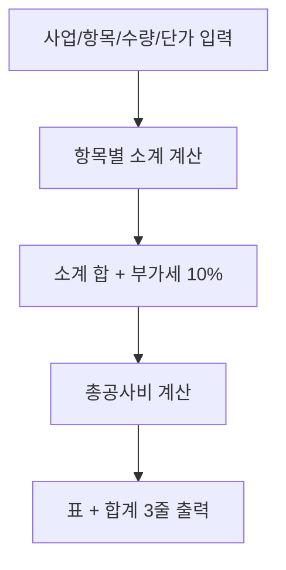

# 🏢 업무부 — 사업별 견적서 초안

> 5차 커리큘럼 4부서 시나리오 카드 (4/4)
> 2회차 3교시 v1 예시 · 3회차 v2 예시 통합본

---

## 시나리오 한 줄

> **(주)멋진엔지니어링** 업무부 견적 담당자가 사업명·발주처·공종·항목별 수량·단가를 받아 표준 견적서 초안을 작성하는 업무.

## 빈도·소요시간

- **빈도**: 사업당 1~2회 (월 3~10건)
- **소요시간**: 건당 2~4시간 (항목 수에 따라)
- **자동화 적합도**: ⭐⭐⭐⭐⭐ (반복·양식고정·입출력 명확·계산 핵심)

---

## 입력 예시 (가공 데이터)

```
사업명: ○○지구 도로개설공사
발주처: ○○시청 도시건설국
공종: 토목공사
항목 목록:
- 토공: 1식 × 50,000,000원
- 포장: 1식 × 80,000,000원
- 배수공: 1식 × 25,000,000원
- 부대공: 1식 × 15,000,000원
```

## 출력 예시

```markdown
# 견적서 초안

**사업명**: ○○지구 도로개설공사
**발주처**: ○○시청 도시건설국
**공종**: 토목공사
**견적일**: 2026-05-29

| 항목 | 수량 | 단위 | 단가 | 소계 |
|---|---:|:---:|---:|---:|
| 토공 | 1 | 식 | 50,000,000 | 50,000,000 |
| 포장 | 1 | 식 | 80,000,000 | 80,000,000 |
| 배수공 | 1 | 식 | 25,000,000 | 25,000,000 |
| 부대공 | 1 | 식 | 15,000,000 | 15,000,000 |

---

- **소계 합**: 170,000,000원
- **부가세 (10%)**: 17,000,000원
- **총공사비**: **187,000,000원**

(※ 본 견적은 초안이며, 실제 계약 시 조정될 수 있습니다.)
```

---

## 1차 프롬프트 (v1, 4단 구조) — 2회차 3교시

```markdown
# 역할
너는 (주)멋진엔지니어링 업무부 견적서 작성 담당자야.

# 입력
- 사업명: ○○지구 도로개설공사
- 발주처: ○○시청 도시건설국
- 공종: 토목공사
- 항목 목록 (항목명/수량/단가):
  1) 토공 / 1식 / 50,000,000원
  2) 포장 / 1식 / 80,000,000원
  3) 배수공 / 1식 / 25,000,000원
  4) 부대공 / 1식 / 15,000,000원

# 처리
1. 각 항목별 소계 = 수량 × 단가
2. 부가세 = 항목 소계 합 × 10%
3. 총공사비 = 소계 합 + 부가세

# 출력
| 항목 | 수량 | 단가 | 소계 |
표 + 하단 [소계 합 / 부가세 / 총공사비] 3줄
```

---

## 6요소 추가분 (v2) — 3회차 1교시

### # 예시 (NEW)

```markdown
# 예시 (Few-shot 1건)
입력: 사업="○○도로", 항목={토공: 1식 × 50,000,000원, 포장: 1식 × 80,000,000원}
↓
| 토공 | 1식 | 50,000,000 | 50,000,000 |
| 포장 | 1식 | 80,000,000 | 80,000,000 |
소계: 130,000,000 / 부가세: 13,000,000 / 총공사비: 143,000,000

→ 천 단위 콤마 필수
→ 단가·소계는 우측 정렬
→ 마지막 3줄(소계/부가세/총)은 별도 강조
```

### # 예외 (NEW)

```markdown
# 예외 처리
- 단가가 비어있거나 0원이면 → [단가 확인 필요] 표시
- 수량 단위가 "식"인지 "m²"인지 "ton"인지 입력에 없으면 → [단위 확인] 표시
- 항목이 1개도 없으면 → 견적서 생성 거부 + 사용자에게 항목 요청
- 항목별 단가 차이가 100배 이상이면 → "단가 검토 필요" 경고 한 줄 추가
- 총공사비가 100억 이상이면 → "대형 사업 — 임원 검토 필요" 코멘트 추가
- 부가세 면세 항목(예: 인건비)이 명시되면 → 해당 행은 부가세 0원으로
```

---

## v1 → v2 효과 (실제 경험)

| 측면 | v1 결과 | v2 결과 |
|---|---|---|
| 빈 단가 처리 | 0원으로 계산 (위험) | [확인 필요] 명시 |
| 단위 누락 | "식"으로 임의 가정 | 사용자에게 확인 요청 |
| 천단위 콤마 | 가끔 누락 | 100% 일관 |
| 대형 사업 경고 | 없음 | 자동 임원 검토 코멘트 |
| 정렬 | 좌측 | 단가/소계 우측 |

---

## 흐름도 (Mermaid flowchart, 5노드)



---

## 관련 슬라이드

- 2회차 슬라이드 35 — v1 프롬프트 예시 (업무부)
- 3회차 슬라이드 52 — v1 → v2 비교 (업무부)

## 보안

- 회사명: (주)멋진엔지니어링 (가공)
- 사업명·발주처·금액·단가 모두 가공
- 실거래정보 0건
