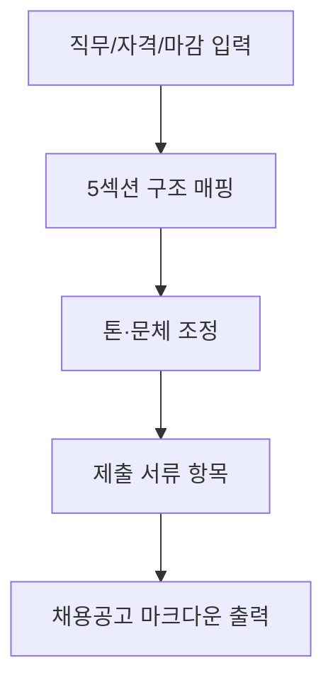

# 🏢 총무부 — 채용공고 자동 작성

> 5차 커리큘럼 4부서 시나리오 카드 (3/4)
> 2회차 3교시 v1 예시 · 3회차 v2 예시 통합본

---

## 시나리오 한 줄

> **(주)멋진엔지니어링** 총무부 채용 담당자가 직무·자격요건·마감일을 받아 표준 채용공고 본문을 작성하는 업무.

## 빈도·소요시간

- **빈도**: 신입 공채(연 2회) + 경력직 수시(월 1~3건)
- **소요시간**: 건당 1.5~2시간 (직무 소개·자격·우대 작성)
- **자동화 적합도**: ⭐⭐⭐⭐ (양식고정·반복·창의 일부 필요)

---

## 입력 예시 (가공 데이터)

```
직무명: 구조설계 엔지니어
채용 인원: 1명
자격요건 키워드: 토목구조 5년 이상, 토목구조기술사 우대
마감일: 2026-06-30
근무지: 서울 본사
```

## 출력 예시

```markdown
# 📢 (주)멋진엔지니어링 — 구조설계 엔지니어 1명 채용

## 직무 소개
토목구조 설계 분야 5년 이상 경력자를 모십니다.
국내외 대형 인프라 프로젝트의 구조 설계·검토를 담당하실 분을 찾습니다.

## 자격 요건
- 토목공학·구조공학 관련 학과 졸업 (학사 이상)
- 토목구조 설계 실무 경력 5년 이상
- AutoCAD·MIDAS·STAAD 등 구조해석 프로그램 활용 가능

## 우대 사항
- 토목구조기술사 자격 보유
- 영문 보고서 작성 가능
- 해외 프로젝트 경험

## 전형 절차
1. 서류 전형 (~6/30)
2. 1차 면접 (7월 초)
3. 임원 면접 (7월 중순)
4. 최종 합격자 발표 (7월 말)

## 제출 서류
- 이력서 (자유 양식)
- 자기소개서 (1,500자 내외)
- 경력기술서 (수행 프로젝트 5건 이상)

## 마감일
2026-06-30 (월) 18:00
```

---

## 1차 프롬프트 (v1, 4단 구조) — 2회차 3교시

```markdown
# 역할
너는 (주)멋진엔지니어링 총무부 채용 담당자야.

# 입력
- 직무명: 구조설계 엔지니어
- 채용 인원: 1명
- 자격요건 키워드: 토목구조 5년 이상, 토목구조기술사 우대
- 마감일: 2026-06-30
- 근무지: 서울 본사

# 처리
1. 위 정보로 채용공고 본문을 작성해줘
2. [직무 소개] [자격 요건] [우대 사항] [전형 절차] [제출 서류] 5섹션 구조
3. 우리 회사 톤은 "친근하지만 전문적"으로

# 출력
바로 사내 공지로 붙여넣을 수 있는 마크다운 형식
```

---

## 6요소 추가분 (v2) — 3회차 1교시

### # 예시 (NEW)

```markdown
# 예시 (Few-shot 1건)
입력: 직무="구조설계 5년 이상", 인원=1명, 우대="토목구조기술사", 마감="2026-06-30"
↓
출력:
[직무 소개] 토목구조 설계 분야 5년 이상 경력자를 모십니다...
[자격 요건] 토목구조 관련 학과 졸업 / 실무 경력 5년 이상
[우대 사항] 토목구조기술사 ...
[전형 절차] 서류 → 1차 면접 → 임원 면접 → 최종 발표
[제출 서류] 이력서 / 자기소개서 / 경력기술서

→ 자격 요건은 "필수", 우대 사항은 "가산점" 톤 구분
→ 전형 절차는 단계 번호 매기기
```

### # 예외 (NEW)

```markdown
# 예외 처리
- 마감일이 영업일 기준 7일 미만이면 → 헤더에 [긴급 채용] 표시
- 우대사항이 빈칸이면 → "우대 사항" 섹션 자체를 생략
- 신입 공채인지 경력직 수시인지 입력에 명시 안 됨 → 사용자에게 되묻기
- 자격요건이 1줄 미만이면 → "자격 요건 추가 입력 필요" 안내
- 근무지가 없으면 → "근무지: 본사(서울)" 기본값 사용 + 확인 요청
```

---

## v1 → v2 효과 (실제 경험)

| 측면 | v1 결과 | v2 결과 |
|---|---|---|
| 우대사항 빈칸 | "우대사항: 없음" 어색 | 섹션 자체 생략 |
| 긴급 채용 표시 | 일반 공고로 발행 | 헤더에 [긴급] 자동 추가 |
| 자격/우대 톤 | 비슷한 어조 | 필수 vs 가산점 구분 |
| 전형 절차 | AI가 임의 추가 | 사용자 입력 그대로 |

---

## 흐름도 (Mermaid flowchart, 5노드)



---

## 관련 슬라이드

- 2회차 슬라이드 34 — v1 프롬프트 예시 (총무부)
- 3회차 슬라이드 51 — v1 → v2 비교 (총무부)

## 보안

- 회사명: (주)멋진엔지니어링 (가공)
- 직무·일자 모두 가공
- 실재 채용 정보 0건
