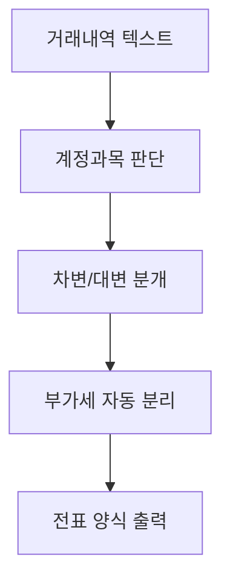

# 🏢 회계부 — 거래내역 → 전표 분개

> 5차 커리큘럼 4부서 시나리오 카드 (1/4)
> 2회차 라이브 시연 사례 · 3교시 v1 예시 · 3회차 v2 예시 통합본

---

## 시나리오 한 줄

> **(주)멋진엔지니어링** 관리부 회계 담당자가 매일 발생하는 거래 5~20건을 받아 전표로 분개하는 업무.

## 빈도·소요시간

- **빈도**: 매일 5~20건
- **소요시간**: 건당 3~5분, 일평균 1시간 (월말 마감 시 3시간 이상)
- **자동화 적합도**: ⭐⭐⭐⭐⭐ (반복·양식고정·입출력 명확·계산 단순)

---

## 입력 예시 (가공 데이터)

```
2026-05-15 / (주)○○문구 / 1,100,000원 / 사무용품 구입
2026-05-15 / 한국통신 / 88,000원 / 5월 전화요금
2026-05-16 / (주)○○건설 / 50,000,000원 / 설계용역 수주 입금
2026-05-16 / ○○카드사 / 330,000원 / 5월 법인카드 결제 (식대)
2026-05-17 / (주)○○자재 / 2,200,000원 / 자재 구입 (부가세포함)
```

## 출력 예시

| 일자 | 거래처 | 계정과목 | 차변 | 대변 | 부가세 | 적요 |
|---|---|---|---:|---:|---:|---|
| 2026-05-15 | ○○문구 | 소모품비 | 1,000,000 | | 100,000 | 사무용품 |
| 2026-05-15 | 한국통신 | 통신비 | 80,000 | | 8,000 | 5월 전화 |
| 2026-05-16 | ○○건설 | 매출 | | 45,454,545 | 4,545,455 | 설계용역 |
| 2026-05-16 | ○○카드사 | 복리후생비 | 300,000 | | 30,000 | 법인카드 식대 |
| 2026-05-17 | ○○자재 | 자재비 | 2,000,000 | | 200,000 | 자재 구입 |

---

## 1차 프롬프트 (v1, 4단 구조) — 2회차 3교시

```markdown
# 역할
너는 (주)멋진엔지니어링 회계부 전표 분개 담당자야.

# 입력
아래 거래내역(텍스트) 5건:

2026-05-15 / (주)○○문구 / 1,100,000원 / 사무용품 구입
2026-05-15 / 한국통신 / 88,000원 / 5월 전화요금
2026-05-16 / (주)○○건설 / 50,000,000원 / 설계용역 수주 입금
2026-05-16 / ○○카드사 / 330,000원 / 5월 법인카드 결제 (식대)
2026-05-17 / (주)○○자재 / 2,200,000원 / 자재 구입 (부가세포함)

# 처리
1. 각 거래의 계정과목을 판단해줘
2. 차변/대변으로 분개해줘
3. 부가세 10%는 자동으로 분리해줘

# 출력
| 일자 | 거래처 | 계정과목 | 차변 | 대변 | 부가세 | 적요 |
표 형식으로 정리해줘.
```

---

## 6요소 추가분 (v2) — 3회차 1교시

위 v1에 아래 2개 섹션만 추가하면 됩니다.

### # 예시 (NEW)

```markdown
# 예시 (Few-shot 1건)
입력: "2026-05-10 / OO상사 / 1,100,000원 / 사무용품"
↓
출력:
| 2026-05-10 | OO상사 | 소모품비 | 1,000,000 | | 100,000 | 사무용품 |

→ 부가세 10%(=100,000원)는 별도 분리, 차변에 공급가액(1,000,000)만
```

### # 예외 (NEW)

```markdown
# 예외 처리
- 금액이 비어있거나 0원이면 → [확인필요] 표시 + 사용자에게 다시 묻기
- 적요만 있고 거래처가 없으면 → 거래처 [미상] 처리
- 수주·입금처럼 매출 거래는 → 대변에 적고 차변 비움
- 부가세 면세 항목(통신비, 인건비 등)은 부가세 0원으로 표시
- 같은 일자 같은 거래처가 2건 이상이면 → 그대로 2줄로 분리 (병합 X)
```

---

## v1 → v2 효과 (실제 경험)

| 측면 | v1 결과 | v2 결과 |
|---|---|---|
| 부가세 분리 정확도 | 5건 중 2건 누락 | 5건 전부 정확 |
| 매출/매입 구분 | 가끔 혼동 | 100% 구분 |
| 빈칸 처리 | 그냥 빼버림 | [확인필요] 명시 |
| 신뢰도 | 70% (재검증 필요) | 90% (그대로 결재 상신 가능) |

---

## 흐름도 (Mermaid flowchart, 5노드)



→ 2교시 라이브 시연용 (mermaid.live에 그대로 붙여넣기 가능)

---

## 관련 슬라이드

- 2회차 슬라이드 26 — 라이브 시연 (mermaid.live)
- 2회차 슬라이드 32 — v1 프롬프트 예시 (회계부)
- 3회차 슬라이드 49 — v1 → v2 비교 (회계부)

## 보안

- 회사명: (주)멋진엔지니어링 (가공)
- 거래처·금액·일자 모두 가공
- 실거래정보 0건
