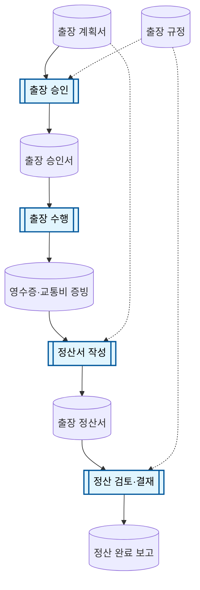

# 업무 흐름도 작성 규격

> AI에게 업무 흐름도를 요청할 때 **이 파일 전체**를 함께 첨부하세요.

## 노드 유형 (2종만)

### 산출물 (Artifact)

문서·데이터·파일·보고서

```
산출물명[("산출물 이름")]
```

### 프로세스 (Process)

사람이 하는 작업·절차

```
프로세스명[["프로세스 이름"]]:::proc
```

## 화살표

| 화살표 | 의미 |
|--------|------|
| `-->` | 생산/소비 (주요 입력·출력) |
| `-.->` | 참조 (규정·양식 등) |

## 교대 규칙

산출물 → 프로세스 → 산출물 → … (프로세스끼리·산출물끼리 직접 연결 금지)

## 스타일 (마지막에 필수)

```
classDef proc fill:#e1f5fe,stroke:#01579b,stroke-width:2px,color:#000
```

## 목표

- 노드 **10~15개**
- `flowchart TD` (위→아래)

## 예시: 출장 정산


