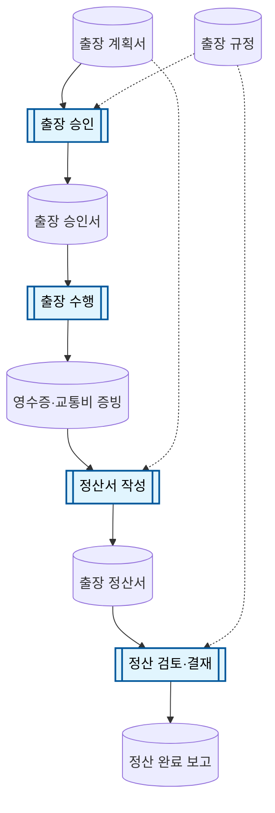

# 출장 정산 업무 흐름도 — 강사 견본

> `업무흐름도_규격.md` 준수 · (주)멋진엔지니어링 가공 시나리오

```mermaid
flowchart TD
    출장규정[("출장 규정")]
    출장계획서[("출장 계획서")]
    출장승인[["출장 승인"]]:::proc
    승인서[("출장 승인서")]
    출장수행[["출장 수행"]]:::proc
    영수증[("영수증·교통비 증빙")]
    정산작성[["정산서 작성"]]:::proc
    정산서[("출장 정산서")]
    정산검토[["정산 검토·결재"]]:::proc
    정산보고[("정산 완료 보고")]

    출장계획서 --> 출장승인 --> 승인서
    승인서 --> 출장수행 --> 영수증
    영수증 --> 정산작성 --> 정산서
    정산서 --> 정산검토 --> 정산보고

    출장규정 -.-> 출장승인
    출장계획서 -.-> 정산작성
    출장규정 -.-> 정산검토

    classDef proc fill:#e1f5fe,stroke:#01579b,stroke-width:2px,color:#000
```

**Session 3 HTML 도구 후보**: `정산서 작성` 프로세스
