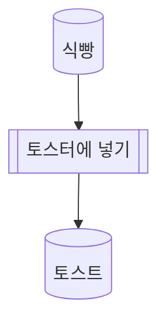
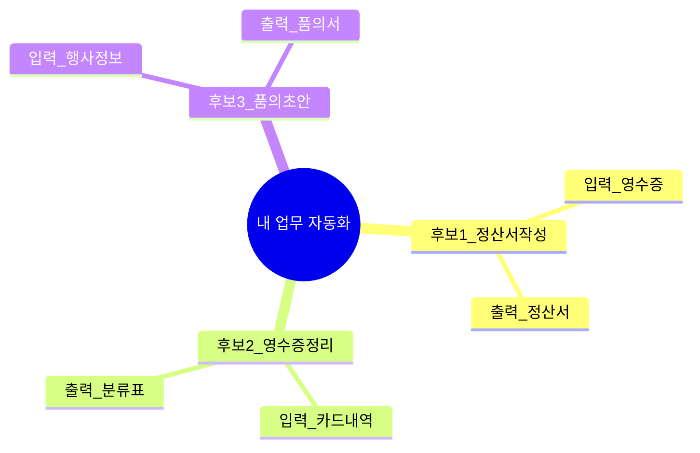

# AI-native로 가는 길

<div class="cover-sub">

2차 TF · Session 02

</div>

<div class="cover-tagline">

Mermaid + <span class="cover-accent">업무 흐름도</span> + HTML 도구 사양서

</div>

<div class="abs-bl mx-14 my-12 cover-footer">
정보시스템실 · 2026. 6. 2.
</div>

<!--
[3시간 운영 안내]
- 50분 × 3교시 + 휴식 10분 × 3
- 1회차 MD·자동화 후보 3개를 오늘 그림으로 펼칩니다
- 3교시 micro-tool-interviewer가 오늘의 클라이맥스
-->

---

# 1회차 5줄 복습 — 지난주 핵심 📌

<div class="space-y-3 mt-6 text-lg">

<v-clicks>

<div class="flex items-center gap-3">
<span class="text-3xl">1️⃣</span>
<div>자동완성 — 맥락과 역할이 모든 것을 결정한다</div>
</div>

<div class="flex items-center gap-3">
<span class="text-3xl">2️⃣</span>
<div>의미공간 — AI는 별자리로 단어를 본다 (계산은 약점)</div>
</div>

<div class="flex items-center gap-3">
<span class="text-3xl">3️⃣</span>
<div>작업기억 — 새 대화 = 백지, 매일 첫 출근하는 신입사원</div>
</div>

<div class="flex items-center gap-3">
<span class="text-3xl">4️⃣</span>
<div>마크다운 — AI와 사람이 모두 잘 읽는 공통어</div>
</div>

<div class="flex items-center gap-3">
<span class="text-3xl">⭐</span>
<div>MD 프롬프트 파일 — 복사 한 번에 재사용하는 업무 대행 AI 뼈대</div>
</div>

</v-clicks>

</div>

<div v-click class="mt-4 text-center text-lg opacity-90">
지난주 과제로 <span class="text-blue-500 font-bold">업무 맥락</span>과 <span class="text-blue-500 font-bold">자동화 후보 3개</span> 잡으셨죠?<br>
오늘은 그걸 <span class="text-purple-500 font-bold">그림</span>으로 펼칩니다.
</div>

---

# 큰 그림 — 9시간 뒤 뭐가 달라지나? 🎯

<div class="mt-6 slide-roadmap-table">

| 회차 | 일자 | 주제 | 회차 끝나면 내 손에 |
|:---:|:---:|:---|:---|
| 1회차 | 5/26 (화) | LLM 원리 + MD 프롬프트 | 업무 맥락 정의서 + 자동화 후보 3개 |
| 2회차 <span class="text-red-500">(오늘)</span> | 6/2 (화) | Mermaid + 업무 흐름도 + 도구 사양 | 업무 흐름도 + HTML 도구 사양서 1건 |
| 3회차 | 6/9 (화) | 바이브 코딩 + 업무 대행 AI 완성 | 본인만의 HTML 업무 대행 AI v1 ✨ |

</div>

<div class="slide-roadmap-outcome text-center">
<span class="text-lg opacity-90">9시간 뒤, 교육생분 한 분 한 분의 손에<br>
<span class="text-2xl font-bold text-blue-500">본인 업무를 대신해주는 AI 한 개</span>가 쥐어집니다.</span>

<div class="slide-roadmap-preview-intro text-sm opacity-80">💡 <span class="font-bold">미리보기 — 3회차에 이런 HTML 도구를 직접 만듭니다</span> (클릭하면 새 탭에서 열립니다)</div>

<div class="grid grid-cols-3 gap-2 mt-2 text-xs mx-auto slide-roadmap-tools">
<a href="./tools/01-expense-calc.html" target="_blank" class="block p-2 bg-blue-50 dark:bg-blue-900 rounded hover:bg-blue-100">💰 출장비 항목 합산</a>
<a href="./tools/02-receipt-parser.html" target="_blank" class="block p-2 bg-blue-50 dark:bg-blue-900 rounded hover:bg-blue-100">🧾 영수증 텍스트 정리</a>
<a href="./tools/03-flowchart-helper.html" target="_blank" class="block p-2 bg-blue-50 dark:bg-blue-900 rounded hover:bg-blue-100">📊 흐름도 도우미</a>
</div>

<div class="mt-3 text-xs opacity-60">⚠ 위 예시는 <span class="font-bold">교육용 placeholder</span> — 3회차에 교육생분 HTML로 교체됩니다</div>
</div>

---

# 본 교육이 하지 않는 일 🚫

<div class="grid grid-cols-1 gap-3 mt-3 text-lg slide-not-cards">

<v-clicks>

<div class="p-4 rounded-lg bg-red-50 border-l-4 border-red-400">

❌ 코딩 — 교육생분이 키보드로 코드를 짤 일은 없습니다.<br>
<span class="text-sm opacity-70">3회차에 AI에게 시키기만 합니다.</span>

</div>

<div class="p-4 rounded-lg bg-red-50 border-l-4 border-red-400">

❌ 새 솔루션 도입 결정 — "○○ AI 도구 사야 할까요?" 는 본 교육 범위가 아닙니다.

</div>

<div class="p-4 rounded-lg bg-green-50 border-l-4 border-green-500">

✅ 우리가 하는 일: 1회차 MD를 <span class="font-bold">그림(Mermaid)</span>과 <span class="font-bold">도구 사양서</span>로 확장하기.

</div>

</v-clicks>

</div>

---

# 사용 도구 — 딱 4개 🛠

<div class="mt-6 slide-tools-table">

| 도구 | 용도 | 비용 |
|:---:|:---|:---:|
| 🎨 mermaid.live | Mermaid 흐름도·마인드맵 미리보기 | 0원 |
| 💬 ChatGPT | 대화·프롬프트 실행 | Plus 권장 (Free도 가능) |
| 💎 Gemini | 대화·프롬프트 실행 (대체) | Advanced 권장 |
| 📝 메모장 | MD·Mermaid 파일 만들기 | 0원 |

</div>

<div class="mt-3 text-center text-lg slide-tools-footnote">
모두 <span class="text-blue-500 font-bold">이미 갖고 계시거나 무료로 쓸 수 있는 것</span>.<br>
<span class="opacity-70 text-base">1회차 markdownlivepreview.com은 복습용으로만 — 오늘은 mermaid.live가 메인.</span>
</div>

---

# ⭐ 2회차 목표 — 오늘 끝나면 이걸 할 수 있다

<div class="slide-goals-list mt-2">

<v-clicks>

<div class="slide-goals-card p-4 rounded-xl bg-blue-50 border-2 border-blue-300">

① 업무 흐름을 Mermaid flowchart로 그릴 수 있다 🎨

<div class="slide-goals-sub opacity-70 mt-2">박스와 화살표로 "무엇 → 어떤 일 → 무엇"을 텍스트로 표현</div>

</div>

<div class="slide-goals-card p-4 rounded-xl bg-purple-50 border-2 border-purple-300">

② 자동화 후보 3개를 mindmap으로 구조화할 수 있다 🧠

<div class="slide-goals-sub opacity-70 mt-2">1회차 후보 3개 → 입력·출력·병목을 한눈에</div>

</div>

<div class="slide-goals-card p-4 rounded-xl bg-yellow-50 border-2 border-yellow-400">

③ 프롬프트 3요소(Input / Instruction / Output)를 구분할 수 있다 ✂️

<div class="slide-goals-sub opacity-70 mt-2">1회차 MD 6칸과 연결 — 3회차 코딩 준비</div>

</div>

<div class="slide-goals-card p-4 rounded-xl bg-green-50 border-2 border-green-300">

④ micro-tool-interviewer로 HTML 도구 사양서 초안 1건 📋

<div class="slide-goals-sub opacity-70 mt-2">3회차에 만들 도구 1개 — 입·출력·화면까지 문서화 ← <span class="font-bold">오늘의 핵심</span></div>

</div>

</v-clicks>

</div>

---
layout: center
class: text-center slide-hero slide-success-scene
---

# 2회차의 진짜 성공 장면 🎬

<div class="text-left bg-gray-900 text-green-300 p-4 rounded-xl font-mono text-sm leading-relaxed mx-auto mt-2">

```
🗓 다음 달 출장 복귀 후

  "아 출장 정산서 또 작성해야 하는데..."
        ↓
📂 내 PC \ 문서 \ 프롬프트 \ 출장정산_흐름도.md  열기
        ↓
🎨 Mermaid로 그려 둔 업무 흐름도 확인
        ↓
📋 micro-tool 사양서 — 입력·출력·화면 스케치
        ↓
🌐 3회차 HTML 도구로 영수증 붙여넣기
        ↓
✨ 출장 정산서 초안 → 2시간이 10분으로
```

</div>

<div class="mt-6 text-lg opacity-90">
오늘 손에 <span class="text-blue-500 font-bold">흐름도 1장 + 사양서 1건</span> — 3회차 코딩만 남습니다.
</div>

---

# 2회차 상세 목차 📑

<div class="mt-4">

| 교시 | 시간 | 큰 주제 | 한 줄 |
|:---:|:---:|:---|:---|
| 1교시 | 13:00 ~ 13:50 | Draw Toast + Mermaid flowchart | "손그림 → 텍스트 그림" |
| ☕ | 13:50 ~ 14:00 | 휴식 10분 | — |
| 2교시 | 14:00 ~ 14:50 | mindmap + diagram-spec + 업무 흐름도 | "내 업무가 한 장의 그림으로" |
| ☕ | 14:50 ~ 15:00 | 휴식 10분 | — |
| 3교시 ⭐ | 15:00 ~ 15:50 | 3요소 + micro-tool-interviewer | "만들 도구 1개, 사양서까지" |
| 마무리 | 15:50 | 종료 — 정리·과제·예고·Q&A | — |

</div>

---
layout: statement
class: text-center slide-statement
---

# 두 가지 부탁 🙏

<div class="slide-statement-block">

📵 스마트폰은 <span class="text-yellow-500 font-bold">가방 안</span>에,<br>
반드시 <span class="text-yellow-500 font-bold">무음·진동 OFF</span>로 부탁드립니다.

</div>

<div class="slide-statement-block">

💻 실습용 PC는 <span class="text-yellow-500 font-bold">전원 ON · mermaid.live 열기</span>,<br>
손에 <span class="text-yellow-500 font-bold">마우스를 쥔 채로</span> 들어주세요.

</div>

<div class="slide-statement-note">
강사가 시연할 때 <span class="font-bold">교육생분도 같이 클릭</span>해 보는 것이 가장 빠른 학습입니다.<br>
Draw Toast 아이스브레이커 중에는 <span class="font-bold">AI 사용 금지</span> — 손그림만!
</div>

---

# 🧊 Draw Toast — 왜 "토스트"인가?

<div class="mt-4 text-lg">

<v-clicks>

<div class="p-3 rounded-lg bg-blue-50 dark:bg-blue-900 mb-3">

**목적 ① — "말로는 다 아는데, 생각은 다 다르네?"**

"토스트 만들면 되죠?" — 모두 고개 끄덕. 그런데 **그림**을 그리면 결과가 완전히 달라집니다.

</div>

<div class="p-3 rounded-lg bg-purple-50 dark:bg-purple-900 mb-3">

**목적 ② — 복잡한 일 전, 두뇌 스트레칭**

Mermaid·도구 사양서 같은 어려운 주제 **전** — 손·대화를 먼저 풀어 주는 워밍업.

</div>

<div class="p-3 rounded-lg bg-yellow-50 dark:bg-yellow-900 mb-3">

**목적 ③ — "박스와 화살표" 맛보기**

식빵·토스터·손·잼을 **선으로 연결** — 오늘 배울 업무 흐름도와 같은 원리.

</div>

</v-clicks>

</div>

<div v-click class="mt-3 text-center text-lg font-bold">
💡 *"겉으로는 같은 말을 해도 머릿속 생각은 다르다 — 복잡한 일 전에 **그림으로 꺼내 놓고 싱크** 맞추자!"*
</div>

---

# Draw Toast — 규칙 ✅❌

<div class="grid grid-cols-2 gap-4 mt-4 text-base">

<div class="slide-card bg-green-50 dark:bg-green-900 border-l-4 border-green-500">

**✅ 해도 되는 것**

- **그림만** 그리기
- A4·포스트잇·펜
- 낙서·简笔画 OK
- 2~3분 안에 완성

</div>

<div class="slide-card bg-red-50 dark:bg-red-900 border-l-4 border-red-400">

**❌ 하지 말 것**

- 글·숫자·화살표 **글자** 쓰기
- ChatGPT / Gemini 사용
- 남 그림 비판
- 완벽한 그림 추구

</div>

</div>

<div class="mt-4 text-center text-lg opacity-90">
미술 잘 못 그려도 됩니다. <span class="text-blue-500 font-bold">낙서</span>가 더 좋을 때도 있어요.
</div>

---

# Draw Toast — 진행 단계 (15분)

<div class="mt-4 text-base">

| 단계 | 시간 | 내용 |
|:---:|:---:|:---|
| ① 준비 | 1분 | A4·펜 나눠 주기 |
| ② 그리기 | 2~3분 | **말·글자 금지**, 「토스트 만드는 법」**그림만** |
| ③ 붙이고 비교 | 4~5분 | 벽/책상에 쭉 붙여 **전체 구경** |
| ④ 이야기 | 4~5분 | 유형 차이 관찰 — 토스터 vs 프라이팬 vs 밀밭 |
| ⑤ 연결 | 1분 | "오후엔 **업무**를 Mermaid로" |

</div>

<div class="mt-4 p-3 bg-gray-100 dark:bg-gray-800 rounded text-base">

**강사 멘트 (② 그리기 시작)**

> *"**말이나 글자는 쓰지 마세요.** **오직 그림으로만** '토스트 만드는 법'을 그려 보세요. 토스트를 한 번도 안 만들어 본 사람에게 가르친다고 생각하세요. **3분** — 시작!"*

</div>

<!--
[강사 노트 — Draw Toast]
- 타이머 3분 → "연필 내려놓으세요"
- 붙일 벽 없으면 책상 위에 펼쳐 두고 자리 돌아다니기
- 질문: "어디서 시작? 식빵? 토스터? 밭?" / "가장 많은 요소?"
- AI·Mermaid 시연 절대 섞지 않음 — Part 2에서
-->

---

# Draw Toast — A / B / C 유형 비교

<div class="mt-4">

| 유형 | 그리는 것 | 집중 | 한마디 |
|:---:|:---|:---|:---|
| **A** | 토스터기 → 식빵 → 잼 | **과정** | "핵심만!" |
| **B** | 프라이팬·버터·식빵 굽기 | **방법** | "방법이 중요" |
| **C** | 밀밭 → 공장 → 마트 → 집 → 토스터 | **스케일** | "전체 연결" |

</div>

<div class="mt-4 p-3 bg-yellow-50 dark:bg-yellow-900 rounded text-base text-center">
→ **같은 단어 "토스트"**를 써도, 머릿속 그림의 범위·깊이는 사람마다 다릅니다.<br>
오늘 오후 **출장 정산 업무** 흐름도를 그릴 때도 **똑같이** 일어납니다.
</div>

<div class="mt-3 text-sm opacity-80 text-center">

| 칸 | 기록 (선택) |
|:---|:---|
| 내 그림 시작점 | (식빵 / 토스터 / …) |
| 요소 개수 | (   )개 |
| 남과 가장 달랐던 점 | (한 줄) |

</div>

---

# Draw Toast → Mermaid — 다리 🌉

<div class="grid grid-cols-2 gap-4 mt-4 text-base">

<div class="slide-card bg-orange-50 dark:bg-orange-900">

**아까 (손그림)**

- 박스 = 식빵, 토스터, 잼
- 화살표 = 순서·연결
- 사람마다 다름

</div>

<div class="slide-card bg-blue-50 dark:bg-blue-900">

**이제 (Mermaid)**

- 박스 = `[("산출물")]` `[["프로세스"]]`
- 화살표 = `-->` `-->`
- **팀이 공유하는 규칙** (diagram-spec)

</div>

</div>

<div class="mt-4 text-center text-xl">
보셨죠? **'토스트' 한 마디**인데 그림은 전부 다릅니다.<br>
오늘 오후에는 **출장 정산** 업무를 **텍스트 그림**(Mermaid)으로 펼칩니다. ☕
</div>

<div class="mt-3 text-center">
👉 <a href="https://mermaid.live/" target="_blank" class="text-blue-600 font-bold underline">mermaid.live</a> 열어 주세요.
</div>

---
layout: section
---

# 1교시 — 손그림에서 텍스트 그림으로

<div class="text-4xl mt-4">Mermaid flowchart</div>

<div class="opacity-60 mt-4 text-xl">

🎨 컴퓨터가 읽는 업무 흐름도

</div>

---

# Mermaid란? — MD 안의 그림 📐

<div class="grid grid-cols-2 gap-4 mt-3 text-base">

<div class="slide-card bg-gray-50 dark:bg-gray-800">

**한 줄 정의**

마크다운 파일 안에 **텍스트로 그림**을 그리는 문법.

- PPT·Visio 대신 **메모장 + mermaid.live**
- AI도 Mermaid를 **읽고 쓸 수 있음**
- 오늘은 **flowchart + mindmap** 2종만 (B안)

</div>

<div class="slide-card bg-blue-50 dark:bg-blue-900 font-mono text-xs leading-snug">



<div class="text-xs mt-2 opacity-80 font-sans">↑ Draw Toast를 텍스트로 옮긴 것</div>

</div>

</div>

<div class="mt-3 text-center text-lg">
💡 Mermaid = **사람·AI·도구가 공유하는 업무 그림 언어**
</div>

---

# flowchart 문법 치트시트 📝

<div class="mt-2 text-sm">

| 문법 | 의미 | 예시 |
|:---:|:---|:---|
| `flowchart TD` | 위→아래 방향 | `flowchart TD` |
| `A --> B` | 실선 화살표 (순서) | `식빵 --> 토스터` |
| `A -.-> B` | 점선 화살표 (참조) | `규정 -.-> 승인` |
| `[("이름")]` | **산출물** (둥근 모서리) | `[("출장 계획서")]` |
| `[["이름"]]` | **프로세스** (사각형) | `[["정산서 작성"]]` |
| `classDef proc ...` | 프로세스 스타일 | `classDef proc fill:#e1f5fe` |
| `:::proc` | 노드에 스타일 적용 | `[["승인"]]:::proc` |

</div>

<div class="mt-4 p-3 bg-yellow-50 dark:bg-yellow-900 rounded text-center text-base">
⚠ 오늘은 **flowchart + mindmap** 만 — sequenceDiagram·gantt 등은 3회차 이후
</div>

---

# 🎬 라이브 시연 — mermaid.live에서 토스트

<div class="slide-sub">강사 시연 5분 — 교육생분도 같이 입력</div>

<div class="grid grid-cols-2 gap-3 mt-2 text-sm">

<div class="slide-card bg-gray-50 dark:bg-gray-800 font-mono text-xs">

① <a href="https://mermaid.live/" target="_blank" class="text-blue-500 underline">mermaid.live</a> 열기

② 왼쪽에 아래 코드 붙여넣기

```
flowchart TD
    식빵[("식빵")]
    토스터[["토스터에 넣기"]]
    토스트[("토스트")]

    식빵 --> 토스터 --> 토스트
```

③ 오른쪽에 **그림이 바로** 나타남

</div>

<div class="slide-card bg-blue-50 dark:bg-blue-900">

**확인 포인트**

- `flowchart TD` — 방향
- `[("  ")]` — 산출물 모양
- `[["  "]]` — 프로세스 모양
- `-->` — 화살표

<div class="mt-2 text-xs opacity-80">한 글자만 바꿔도 그림이 즉시 바뀜</div>

</div>

</div>

<!--
[강사 노트 — mermaid.live 시연]
1. mermaid.live 새 탭 열기
2. 토스트 3노드부터 → 노드 하나씩 추가하며 설명
3. TD → LR 바꿔 방향 변화 보여주기
4. "아까 Draw Toast 그림 — 이제 키보드로"
-->

---

# ⏱ 실습 ① — flowchart 직접 그리기 (15분)

<div class="exercise-instruction">15분 · 1인 1파일 — 출장 정산 **3노드**부터 시작</div>

<div class="grid grid-cols-2 gap-3 mt-2 text-sm">

<div class="slide-card bg-blue-50 dark:bg-blue-900 border-l-4 border-blue-500">

**① 진행**

1. mermaid.live 열기
2. 아래 **3노드**부터 시작
3. 노드를 **2~3개씩** 추가
4. `classDef proc` 스타일 적용

```
flowchart TD
    계획서[("출장 계획서")]
    승인[["출장 승인"]]
    승인서[("출장 승인서")]
    계획서 --> 승인 --> 승인서
```

</div>

<div class="slide-card border border-gray-200 dark:border-gray-600">

**② 워크시트**

| 항목 | 기록 |
|:---|:---|
| 노드 개수 | (   )개 |
| 산출물 / 프로세스 | (   ) / (   ) |
| 막혔던 점 | (한 줄) |

<div class="mt-2 opacity-80">→ 마지막 3분: 옆 사람과 비교</div>

</div>

</div>

<div class="exercise-lab-banner mt-2">
💡 Draw Toast처럼 **사람마다 다름** — 오늘은 diagram-spec으로 **팀 규칙**을 맞춥니다
</div>

---

# Mermaid 자주 하는 실수 ⚠️

<div class="grid grid-cols-1 gap-3 mt-3 text-base">

<v-clicks>

<div class="p-3 rounded-lg bg-red-50 border-l-4 border-red-400">

**실수 ① — 괄호 짝이 안 맞음**

❌ `[("출장 계획서"]` → ❌ 파싱 오류<br>
✅ `[("출장 계획서")]` — 여는 괄호와 닫는 괄호 **쌍** 확인

</div>

<div class="p-3 rounded-lg bg-red-50 border-l-4 border-red-400">

**실수 ② — 방향 키워드 오타**

❌ `flowcart TD` / `graph LR` (구버전 혼동)<br>
✅ `flowchart TD` — **flowchart** 철자

</div>

<div class="p-3 rounded-lg bg-red-50 border-l-4 border-red-400">

**실수 ③ — 한글 노드 ID에 공백**

❌ `출장 계획서[("...")]` (공백 있음)<br>
✅ `출장계획서[("출장 계획서")]` — ID는 붙여 쓰기, 표시명은 따옴표 안

</div>

</v-clicks>

</div>

<div v-click class="mt-3 text-center text-base opacity-90">
💡 mermaid.live는 **오류 줄을 빨간색**으로 표시 — Ctrl+Z로 되돌리기 OK
</div>

---

# Mermaid 팁 — AI에게 도움 받기 🤖

<div class="grid grid-cols-2 gap-3 mt-3 text-sm">

<div class="slide-card bg-green-50 dark:bg-green-900">

**✅ 이렇게 요청**

> "아래 업무를 Mermaid flowchart로 그려줘.  
> 산출물은 `[("  ")]`, 프로세스는 `[["  "]]` 로."

+ 본인 업무 맥락 문서(A~E) 붙여넣기

</div>

<div class="slide-card bg-red-50 dark:bg-red-900">

**❌ 이렇게 하면 안 됨**

> "흐름도 그려줘"

→ AI가 **임의 문법**으로 그림 → mermaid.live에서 안 열림

</div>

</div>

<div class="mt-4 text-center text-lg">
🎯 **출력 형식을 미리 지정** — 1회차 MD [출력 형식]과 같은 원리
</div>

---
layout: center
class: text-center break-slide
---

# ☕ 휴식 10분

<div class="slide-break-body">

2교시 예고<br>
mindmap + diagram-spec + 출장 정산 흐름도

</div>

<div class="slide-break-icon">⏰</div>

---
layout: section
---

# 2교시 — 내 업무가 한 장의 그림으로

<div class="text-4xl mt-4">mindmap + diagram-spec</div>

<div class="opacity-80 mt-6 text-xl leading-relaxed">

📊 자동화 후보 3개 → 구조화 → 팀 규격 흐름도

</div>

---

# mindmap — 왜 후보 3개에 쓰나? 🧠

<div class="grid grid-cols-2 gap-4 mt-3 text-base">

<div class="slide-card bg-purple-50 dark:bg-purple-900">

**1회차에서 잡은 것**

- 자동화 후보 **3개**
- 각 후보마다 입력·출력·병목이 **머릿속**에만

</div>

<div class="slide-card bg-blue-50 dark:bg-blue-900">

**mindmap으로 펼치면**

- 3개 후보 **한눈에** 비교
- 어느 걸 3회차 도구로 만들지 **선택** 쉬움
- flowchart와 **역할 분담**: mindmap=구조, flowchart=순서

</div>

</div>

<div class="mt-4 font-mono text-xs bg-gray-900 text-green-300 p-3 rounded-xl">



</div>

---

# mindmap 문법 치트시트 📝

<div class="mt-3 text-sm">

| 문법 | 의미 | 예시 |
|:---:|:---|:---|
| `mindmap` | 마인드맵 시작 | `mindmap` |
| `root((텍스트))` | 중심 주제 | `root((내 업무))` |
| `  하위노드` | **들여쓰기 2칸** = 하위 | `    입력` |
| 들여쓰기 깊이 | 레벨 = 트리 깊이 | 2칸·4칸·6칸… |

</div>

<div class="mt-4 p-3 bg-yellow-50 dark:bg-yellow-900 rounded text-base">

**핵심 규칙**: 하위 노드는 **반드시 2칸 들여쓰기** — 탭/스페이스 혼용 주의

</div>

<div class="mt-3 text-center text-base opacity-90">
flowchart는 `-->` 로 연결, mindmap은 **들여쓰기**로 연결
</div>

---

# ⏱ 실습 ② — mindmap으로 후보 3개 펼치기 (10분)

<div class="exercise-instruction">10분 · 1회차 자동화 후보 3개 활용</div>

<div class="grid grid-cols-2 gap-3 mt-2 text-sm">

<div class="slide-card bg-purple-50 dark:bg-purple-900 border-l-4 border-purple-500">

**① 진행**

1. mermaid.live 새 탭
2. `mindmap` + `root((내 업무 자동화))`
3. 후보 3개 각각 **입력·출력·병목** 3가지
4. 렌더 확인

</div>

<div class="slide-card border border-gray-200 dark:border-gray-600">

**② 체크**

- [ ] 후보 3개 모두 있음
- [ ] 각 후보마다 하위 2개 이상
- [ ] mermaid.live에서 그림 표시

<div class="mt-2 opacity-80">→ 3교시에 **1개만** 골라 도구화</div>

</div>

</div>

---

# mindmap vs flowchart — 언제 뭘 쓰나?

<div class="mt-4">

| | mindmap | flowchart |
|:---|:---|:---|
| **목적** | 구조·분류·브레인스토밍 | 순서·흐름·의존관계 |
| **연결** | 들여쓰기 (트리) | 화살표 (`-->`) |
| **오늘 용도** | 후보 3개 비교 | 출장 정산 **업무 순서** |
| **비유** | 메모장 목차 | 결재선·공정도 |

</div>

<div class="mt-4 text-center text-lg">
💡 둘 다 **Mermaid** — 같은 mermaid.live, 다른 `키워드`만 바꿈
</div>

---

# diagram-spec — 팀이 공유하는 그림 규칙 📏

<div class="text-sm opacity-80 mb-3">(주)멋진엔지니어링 관리부 — 출장비 정산 업무 흐름도 표준</div>

<div class="grid grid-cols-2 gap-3 mt-2 text-sm">

<div class="slide-card bg-blue-50 dark:bg-blue-900">

**노드 2종**

| 기호 | 의미 | 예 |
|:---:|:---|:---|
| `[("  ")]` | **산출물** (문서·데이터) | `[("출장 계획서")]` |
| `[["  "]]` | **프로세스** (사람·시스템 행위) | `[["정산서 작성"]]` |

</div>

<div class="slide-card bg-purple-50 dark:bg-purple-900">

**화살표 2종**

| 기호 | 의미 | 예 |
|:---:|:---|:---|
| `-->` | **순서** (다음 단계) | `A --> B` |
| `-.->` | **참조** (규정·근거) | `규정 -.-> 승인` |

</div>

</div>

<div class="mt-3 p-3 bg-yellow-50 dark:bg-yellow-900 rounded text-center text-base">
**교대 규칙**: 산출물 → 프로세스 → 산출물 → … (둥근↔사각 **번갈아**)
</div>

---

# diagram-spec — 교대 규칙 예시 🔄

<div class="font-mono text-xs bg-gray-900 text-green-300 p-3 rounded-xl mt-2 leading-relaxed">

```
flowchart TD
    출장계획서[("출장 계획서")]     ← 산출물
    출장승인[["출장 승인"]]         ← 프로세스
    승인서[("출장 승인서")]         ← 산출물
    출장수행[["출장 수행"]]         ← 프로세스
    영수증[("영수증·교통비 증빙")]  ← 산출물
    정산작성[["정산서 작성"]]       ← 프로세스
    정산서[("출장 정산서")]         ← 산출물
```

</div>

<div class="mt-3 text-base text-center">
💡 **산출물** = 손에 쥐는 것 (문서·파일) · **프로세스** = 하는 일 (승인·작성·검토)
</div>

<div class="mt-2 text-sm opacity-80 text-center">
Session 3 micro-tool 후보: **`정산서 작성`** 프로세스 → HTML 도구화
</div>

---

# 🎬 라이브 시연 — 출장 정산 흐름도 (12노드)

<div class="slide-sub">2회차 클라이맥스 ① — diagram-spec 완성본</div>

<div class="grid grid-cols-2 gap-3 mt-2 text-xs">

<div class="slide-card bg-gray-50 dark:bg-gray-800 font-mono leading-snug">

```
flowchart TD
    출장규정[("출장 규정")]
    출장계획서[("출장 계획서")]
    출장승인[["출장 승인"]]:::proc
    승인서[("출장 승인서")]
    출장수행[["출장 수행"]]:::proc
    영수증[("영수증·교통비 증빙")]
    정산작성[["정산서 작성"]]:::proc
    정산서[("출장 정산서")]
    정산검토[["정산 검토·결재"]]:::proc
    정산보고[("정산 완료 보고")]

    출장계획서 --> 출장승인 --> 승인서
    승인서 --> 출장수행 --> 영수증
    영수증 --> 정산작성 --> 정산서
    정산서 --> 정산검토 --> 정산보고

    출장규정 -.-> 출장승인
    출장계획서 -.-> 정산작성
    출장규정 -.-> 정산검토

    classDef proc fill:#e1f5fe,stroke:#01579b
```

</div>

<div class="slide-card bg-blue-50 dark:bg-blue-900 text-sm font-sans">

**시연 순서**

1. mermaid.live에 **전체 붙여넣기**
2. `-->` 순서 흐름 짚기
3. `-.->` 참조 3개 짚기
4. `:::proc` 스타일 확인
5. **정산서 작성** 노드 강조 ← 3회차 도구

</div>

</div>

<!--
[강사 노트 — 출장 정산 시연]
- (주)멋진엔지니어링 관리부 직원 시나리오로 멘트
- "영수증·교통비 증빙" = 출장 후 모으는 것
- "정산서 작성" = 오늘 micro-tool로 사양서 쓸 프로세스
- 12노드 전체가 2~3분 안에 렌더되는지 사전 확인
-->

---

# 출장 정산 — 시나리오 한 줄 📋

<div class="p-4 rounded-xl bg-blue-50 dark:bg-blue-900 border-2 border-blue-300 text-lg mt-3">

**(주)멋진엔지니어링** 관리부 직원이 출장 후 **영수증·교통비·출장계획서**를 모아 **출장 정산서**를 작성·제출하는 흐름.

</div>

<div class="grid grid-cols-3 gap-3 mt-4 text-sm">

<div class="slide-card bg-green-50 dark:bg-green-900 text-center">

**입력**

- 영수증 목록
- 출장계획서
- 카드 사용 내역

</div>

<div class="slide-card bg-yellow-50 dark:bg-yellow-900 text-center">

**프로세스 (도구 후보)**

**정산서 작성**

- 항목 분류
- 금액 합산
- 양식 맞춤

</div>

<div class="slide-card bg-purple-50 dark:bg-purple-900 text-center">

**출력**

- 출장 정산서
- 결재용 표
- 회계팀 전달

</div>

</div>

<div class="mt-3 text-center text-base opacity-90">
⚠ 금액·인명·일자는 모두 <span class="font-bold">교육용 가공 데이터</span> — 실거래정보 0건
</div>

---

# diagram-spec + AI — 규격을 프롬프트에 붙이기

<div class="exercise-card mt-2">

<div class="exercise-instruction">ChatGPT/Gemini에 diagram-spec 규칙을 **먼저** 주면 —</div>

<div class="prompt-stack">

```markdown
[출력 형식 — Mermaid flowchart]
- flowchart TD
- 산출물: [("이름")]
- 프로세스: [["이름"]]:::proc
- 순서: -->
- 참조: -.->
- classDef proc fill:#e1f5fe,stroke:#01579b

[작업]
(주)멋진엔지니어링 출장비 정산 업무를 위 규격으로 flowchart 작성

[데이터]
(본인 업무 맥락 문서 A~E 붙여넣기)
```

<div class="prompt-result-bar">

<span class="prompt-result-label">✅ 결과</span>

<span>diagram-spec에 맞는 흐름도 — mermaid.live에 바로 붙여넣기 가능</span>

</div>

</div>

</div>

---

# ⭐ 2교시 클라이맥스 — "내 업무가 그림이 됐다"

<div class="text-center mt-4">

<div class="text-2xl font-bold text-blue-500 mb-4">

방금 그린 출장 정산 12노드 —<br>
여러분 업무도 **같은 방식**으로 한 장이 됩니다.

</div>

<div class="grid grid-cols-2 gap-4 text-base text-left">

<div class="slide-card bg-green-50 dark:bg-green-900">

✅ 오늘 2교시 끝에 손에 남는 것

- mindmap (후보 3개)
- flowchart 초안 (본인 업무)
- diagram-spec 규칙 숙지

</div>

<div class="slide-card bg-purple-50 dark:bg-purple-900">

⭐ 3교시로 이어지는 것

- 후보 3개 중 **1개 선택**
- micro-tool **사양서** 작성
- 화면 스케치 4칸

</div>

</div>

</div>

---

# ⏱ 실습 ③ — 본인 업무 흐름도 초안 (20분)

<div class="exercise-instruction">20분 · 1회차 업무 맥락 문서 + homework-interviewer 결과 활용</div>

<div class="grid grid-cols-2 gap-3 mt-2 text-sm">

<div class="slide-card bg-blue-50 dark:bg-blue-900 border-l-4 border-blue-500">

**① 진행**

1. 1회차 **업무 맥락 문서** 열기<br>
   <a href="https://raw.githubusercontent.com/Baikhojun/yooshin-ai-tf-2026/main/demo-data/homework-interviewer-prompt.md" target="_blank" class="text-blue-500 underline text-xs">📄 homework-interviewer 참고</a>
2. ChatGPT에 diagram-spec + 맥락 문서
3. 나온 Mermaid를 mermaid.live에 붙여넣기
4. **5~8노드**면 OK — 완벽 불필요

</div>

<div class="slide-card border border-gray-200 dark:border-gray-600">

**② 프롬프트 템플릿**

```markdown
[출력 형식]
flowchart TD, diagram-spec 준수
(산출물/프로세스/화살표 규칙)

[작업]
아래 업무 맥락을 flowchart로

[데이터]
(업무 맥락 문서 A~E)
```

</div>

</div>

<div class="exercise-lab-banner mt-2">
💡 **5노드만 있어도 성공** — 3회차 전에 천천히 다듬으면 됩니다
</div>

---

# 실습 ③ — 워크시트 📋

<div class="mt-4 text-sm">

| 항목 | 기록 |
|:---|:---|
| flowchart 노드 수 | (   )개 |
| 산출물 / 프로세스 | (   ) / (   ) |
| 3회차 도구 후보 (프로세스 1개) | ______________ |
| AI가 틀린 부분 (직접 수정) | ______________ |
| 한 줄 소감 | ______________ |

</div>

<div class="mt-4 p-3 bg-yellow-50 dark:bg-yellow-900 rounded text-center text-base">
Draw Toast에서 배운 것: **사람마다 그림이 다르다** → diagram-spec으로 **팀 규칙** 맞추기
</div>

---
layout: center
class: text-center break-slide
---

# ☕ 휴식 10분

<div class="slide-break-body">

3교시: 오늘의 진짜 클라이맥스 ⭐<br>
프롬프트 3요소 + micro-tool-interviewer

</div>

<div class="slide-break-icon">⏰</div>

---
layout: section
---

# 3교시 — 만들 도구 1개, 사양서까지

<div class="text-4xl mt-4">3요소 + micro-tool</div>

<div class="opacity-60 mt-4 text-xl">

📋 3회차 HTML 코딩 전 — 설계도 완성

</div>

---

# 프롬프트 3요소 — Input / Instruction / Output ✂️

<div class="grid grid-cols-3 gap-3 mt-4 text-sm">

<div class="slide-card bg-blue-50 dark:bg-blue-900 text-center">

**Input (입력)**

AI에게 **주는 데이터**

- 영수증 목록
- 출장계획서
- 오늘치 메모

</div>

<div class="slide-card bg-purple-50 dark:bg-purple-900 text-center">

**Instruction (지시)**

AI에게 **시키는 일**

- 역할 + 작업 + 판단 기준
- 1회차 MD 6칸 중 **핵심**

</div>

<div class="slide-card bg-green-50 dark:bg-green-900 text-center">

**Output (출력)**

AI가 **돌려주는 형태**

- Mermaid flowchart
- 정산서 표
- HTML 화면 설명

</div>

</div>

<div class="mt-4 text-center text-lg">
🎯 3회차 바이브 코딩 — **Instruction + Output** 이 HTML 설계도가 됩니다
</div>

---

# 1회차 MD 6칸 ↔ 3요소 연결 🔗

<div class="mt-3 text-sm">

| 1회차 MD 6칸 | 3요소 | 비유 |
|:---|:---|:---|
| [역할] + [작업] + [판단 기준] | **Instruction** | 업무 지시서 |
| [데이터] | **Input** | 오늘치 재료 |
| [출력 형식] + [예시] | **Output** | 결과물 설계 |

</div>

<div class="mt-4 p-3 bg-blue-50 dark:bg-blue-900 rounded text-center text-base">
💡 1회차에서 **6칸**을 채웠다면 — 이미 3요소를 **쪼개서** 쓰고 있었던 것
</div>

---

# 3요소 분해 예시 — 출장 정산 MD 📄

<div class="grid grid-cols-3 gap-2 mt-2 text-xs">

<div class="slide-card bg-blue-50 dark:bg-blue-900">

**Input**

```
[데이터]
- 영수증 5건 (텍스트)
- 출장계획서 (참조)
- 출장 기간·목적
```

</div>

<div class="slide-card bg-purple-50 dark:bg-purple-900">

**Instruction**

```
[역할] 정산 담당자
[작업] 항목 분류·합산
[판단 기준]
- 교통비/숙박/식비 구분
- 규정 초과 → [확인필요]
```

</div>

<div class="slide-card bg-green-50 dark:bg-green-900">

**Output**

```
[출력 형식]
| 항목 | 금액 | 비고 |
|------|------|------|
| 교통비 | | |
| 합계 | | |
```

</div>

</div>

<div class="mt-3 text-center text-sm opacity-90">
3회차 HTML 도구 = **Input 칸에 붙여넣기 → Output 칸에 표 표시**
</div>

---

# 3요소 — micro-tool 관점에서 보기 🔧

<div class="mt-3">

| 3요소 | micro-tool 사양서 섹션 | 3회차 HTML |
|:---|:---|:---|
| Input | 입력 데이터 형식 | `<textarea>` 붙여넣기 |
| Instruction | 처리 규칙·분류 기준 | AI 프롬프트 (PROMPT.txt) |
| Output | 출력 표·문서 형식 | 결과 `<table>` |

</div>

<div class="mt-4 text-center text-lg">
💡 오늘 micro-tool-interviewer = **3요소를 AI와 대화하며 사양서로 확장**
</div>

---

# 3요소 실습 — 본인 MD 분해 (5분)

<div class="exercise-instruction">5분 · 1회차 업무용 MD 1개</div>

<div class="grid grid-cols-2 gap-3 mt-2 text-sm">

<div class="slide-card bg-blue-50 dark:bg-blue-900">

**진행**

1. 1회차 업무 MD 열기
2. 형광펜 3색 (또는 메모):
   - 🟦 Input = [데이터]
   - 🟪 Instruction = [역할][작업][판단]
   - 🟩 Output = [출력][예시]
3. 빠진 칸 있으면 메모

</div>

<div class="slide-card border border-gray-200 dark:border-gray-600">

**체크**

| 요소 | 내 MD에 있나? |
|:---|:---:|
| Input | ☐ |
| Instruction | ☐ |
| Output | ☐ |

<div class="mt-2 opacity-80">→ 다음 micro-tool 인터뷰 재료</div>

</div>

</div>

---

# 3요소 — 자주 하는 실수 ⚠️

<div class="grid grid-cols-1 gap-3 mt-3 text-base">

<div class="p-3 rounded-lg bg-red-50 border-l-4 border-red-400">

**실수 ① — Instruction 없이 Input만**

❌ 영수증 50건 붙여넣기만 → AI가 **임의 형식**으로 정리<br>
✅ [역할][판단 기준] 먼저 → **같은 Input, 다른 Output**

</div>

<div class="p-3 rounded-lg bg-red-50 border-l-4 border-red-400">

**실수 ② — Output이 모호**

❌ "표로 정리해줘" → 열·행 AI 마음대로<br>
✅ `| 항목 | 금액 |` **헤더까지** 지정

</div>

</div>

---
layout: section
---

# micro-tool-interviewer — AI가 도구를 설계하게

<div class="opacity-80 mt-4 text-lg">

🎤 1회차 homework-interviewer의 **도구 버전**

</div>

---

# micro-tool-interviewer — 개념 🎤

<div class="grid grid-cols-2 gap-4 mt-3 text-sm">

<div class="slide-card bg-gray-50 dark:bg-gray-800">

**homework-interviewer (1회차)**

- AI → 교육생분 **질문**
- 결과: **업무 맥락 문서** (A~E)
- "내 업무가 뭐지?" 정리

</div>

<div class="slide-card bg-blue-50 dark:bg-blue-900">

**micro-tool-interviewer (2회차)**

- AI → 교육생분 **질문**
- 결과: **HTML 도구 사양서**
- "3회차에 만들 도구 1개" 설계

</div>

</div>

<div class="slide-banner mt-3 bg-yellow-50 dark:bg-yellow-900">
🪞 답하다 보면 — Input·Instruction·Output·화면까지 **문서로** 완성
</div>

---

# micro-tool-interviewer — 1회차와 비교

| | homework-interviewer | micro-tool-interviewer |
|:---|:---|:---|
| 목적 | 업무 전체 맥락 | **도구 1개** 사양 |
| 산출물 | 업무 맥락 문서 A~E | **도구 사양서** (입·출·UI) |
| 3요소 | 암시적 | **명시적** 분리 |
| 3회차 연결 | MD 프롬프트 재료 | **HTML 코딩** 설계도 |

---

# 🎬 라이브 시연 — micro-tool-interviewer (10분)

<div class="slide-sub">강사 시연 → 교육생분 25분 실습</div>

<div class="grid grid-cols-2 gap-3 mt-2 text-sm">

<div class="slide-card bg-blue-50 dark:bg-blue-900 border-l-4 border-blue-500">

**① 진행**

1. ChatGPT/Gemini 새 대화
2. `micro-tool-interviewer.md` 전체 붙여넣기<br>
   <a href="https://raw.githubusercontent.com/Baikhojun/yooshin-ai-tf-2026-session-02/main/demo-data/micro-tool-interviewer.md" target="_blank" class="text-blue-500 underline text-xs">📄 micro-tool-interviewer 열기</a>
3. AI 질문 1개씩 → 솔직히 답
4. **도구 사양서** + **화면 스케치** 받기

</div>

<div class="slide-card border border-gray-200 dark:border-gray-600">

**② 시나리오 (강사)**

- 후보: **정산서 작성** (출장 정산)
- Input: 영수증 텍스트 + 출장계획서
- Output: 회사 양식 정산서 표
- UI: 붙여넣기 + [계산] 버튼

</div>

</div>

<!--
[강사 노트 — micro-tool 시연]
1. micro-tool-interviewer.md 붙여넣기
2. 첫 질문에 "출장 정산서 작성 도구" 답
3. 3~4턴 후 사양서 초안 확인
4. "입력 화면 / 결과 화면" 스케치 요청
5. 교육생분 실습 시작 — 1회차 homework와 같은 리듬
-->

---

# 화면 스케치 — 4칸 예시 ✏️

<div class="text-sm opacity-80 mb-2">출장 정산서 작성 도구 — 손그림·태블릿 OK</div>

<div class="grid grid-cols-4 gap-2 mt-2 text-xs text-center">

<div class="slide-card bg-gray-100 dark:bg-gray-800 p-3">

**① 입력 화면**

┌─────────┐<br>
│ 영수증  │<br>
│ 붙여넣기│<br>
│ [textarea]│<br>
└─────────┘

</div>

<div class="slide-card bg-blue-50 dark:bg-blue-900 p-3">

**② 결과 화면**

┌─────────┐<br>
│ 정산서  │<br>
│ 표      │<br>
│ 항목|금액│<br>
└─────────┘

</div>

<div class="slide-card bg-green-50 dark:bg-green-900 p-3">

**③ 버튼**

┌─────────┐<br>
│ [계산]  │<br>
│ [초기화]│<br>
└─────────┘

</div>

<div class="slide-card bg-purple-50 dark:bg-purple-900 p-3">

**④ 파일 업로드**

┌─────────┐<br>
│ 📎 CSV  │<br>
│ 드래그  │<br>
└─────────┘

</div>

</div>

<div class="mt-3 text-center text-base">
💡 완벽한 그림 불필요 — **어디에 뭐가 있을지**만 보이면 3회차 OK
</div>

---

# ⏱ 실습 ④ — micro-tool-interviewer (25분)

<div class="exercise-instruction">25분 · 1인 1도구 · mindmap 후보 3개 중 1개 선택</div>

<div class="grid grid-cols-2 gap-3 mt-2 text-sm">

<div class="slide-card bg-blue-50 dark:bg-blue-900">

**① 선택**

mindmap에서 **1개만** 선택:

- 후보1: 정산서 작성
- 후보2: 영수증 정리
- 후보3: (본인 업무)

<div class="mt-2 text-xs opacity-80">3회차 HTML = **딱 1개**만 만듭니다</div>

</div>

<div class="slide-card bg-green-50 dark:bg-green-900">

**② 손에 남는 것**

- 도구 사양서 (개요/입력/처리/출력/UI)
- 화면 스케치 4칸
- Input·Instruction·Output 분리

</div>

</div>

<div class="exercise-lab-banner mt-2">
⭐ **2회차 클라이맥스 ②** — 3회차 코딩만 남기고 오늘 종료
</div>

---

# 도구 사양서 — 목차 템플릿 📋

<div class="mt-3 text-sm font-mono bg-gray-100 dark:bg-gray-900 p-3 rounded-xl leading-relaxed">

```
# [도구명] 사양서

## 1. 개요 — 한 줄 설명
## 2. Input — 입력 데이터 형식·예시
## 3. Instruction — 처리 규칙·분류 기준
## 4. Output — 출력 표·문서 형식
## 5. UI — 화면 구성 (4칸 스케치)
## 6. 예외 — [확인필요] 케이스
```

</div>

<div class="mt-3 text-center text-base opacity-90">
micro-tool-interviewer가 **대화 끝에** 이 형식으로 정리해 줍니다
</div>

---

# ⭐ 3교시 클라이맥스 — "3회차 설계도 완성"

<div class="text-center mt-4">

<div class="text-2xl font-bold text-purple-500 mb-4">

도구 1개 · 사양서 1건 · 화면 스케치 4칸<br>
→ 3회차에 AI에게 **"이대로 HTML 만들어"** 한 마디면 됩니다

</div>

<div class="grid grid-cols-3 gap-3 text-sm">

<div class="slide-card bg-blue-50 dark:bg-blue-900">

**오늘 완료**

✅ Mermaid 흐름도<br>
✅ mindmap<br>
✅ 3요소 이해<br>
✅ 도구 사양서

</div>

<div class="slide-card bg-yellow-50 dark:bg-yellow-900">

**3회차 예고**

🔜 바이브 코딩<br>
🔜 HTML v1 완성<br>
🔜 PROMPT.txt<br>
🔜 실제 데이터 테스트

</div>

<div class="slide-card bg-green-50 dark:bg-green-900">

**placeholder**

<a href="./tools/01-expense-calc.html" target="_blank" class="text-blue-500 underline">01-expense-calc</a><br>
<a href="./tools/02-receipt-parser.html" target="_blank" class="text-blue-500 underline">02-receipt-parser</a><br>
<a href="./tools/03-flowchart-helper.html" target="_blank" class="text-blue-500 underline">03-flowchart-helper</a>

</div>

</div>

</div>

---
layout: section
---

# 마무리

<div class="opacity-60 mt-4 text-xl">

오늘 정리 · 과제 · 3회차 예고

</div>

---

# 오늘 정리 — 5줄로 📌

<div class="space-y-3 mt-6 text-lg">

<v-clicks>

<div class="flex items-center gap-3">
<span class="text-3xl">1️⃣</span>
<div>Draw Toast — 같은 말도 그림은 다르다, 흐름도 전에 싱크 맞추기</div>
</div>

<div class="flex items-center gap-3">
<span class="text-3xl">2️⃣</span>
<div>Mermaid flowchart — 산출물·프로세스·화살표로 업무 순서 표현</div>
</div>

<div class="flex items-center gap-3">
<span class="text-3xl">3️⃣</span>
<div>mindmap — 자동화 후보 3개 구조화, 3회차 도구 1개 선택</div>
</div>

<div class="flex items-center gap-3">
<span class="text-3xl">4️⃣</span>
<div>diagram-spec — 팀 규격 + 출장 정산 12노드</div>
</div>

<div class="flex items-center gap-3">
<span class="text-3xl">⭐</span>
<div>micro-tool-interviewer — HTML 도구 사양서 + 화면 스케치 4칸</div>
</div>

</v-clicks>

</div>

<div v-click class="mt-3 text-center text-lg">
🧳 손에는 **흐름도 + 사양서** — 3회차 바이브 코딩으로 갑니다
</div>

---

# 과제 안내 📚

<div class="text-base opacity-80 mb-3">기한: 6. 9.(화) 오전 9시까지 · <span class="font-bold">Google Forms 없음</span></div>

<div class="grid grid-cols-1 gap-3 mt-2 text-base">

<div class="p-3 rounded-lg bg-blue-50 dark:bg-blue-900 border-l-4 border-blue-500">

과제 ① — 본인 업무 flowchart 다듬기 (필수)

오늘 실습 ③ 초안을 **8노드 이상**으로 보완<br>
<span class="text-sm opacity-80">→ diagram-spec 규칙 준수</span>

</div>

<div class="p-3 rounded-lg bg-purple-50 dark:bg-purple-900 border-l-4 border-purple-500">

과제 ② — micro-tool 사양서 완성 (필수)

오늘 실습 ④ 결과를 다듬어 **6섹션 목차** 완성<br>
<span class="text-sm opacity-80">→ 3회차 HTML 코딩 설계도</span>

</div>

<div class="p-3 rounded-lg bg-yellow-50 dark:bg-yellow-900 border-l-4 border-yellow-500">

과제 ③ — 3요소 분해 연습 (선택·권장)

1회차 업무 MD를 Input / Instruction / Output으로 형광펜 분류

</div>

</div>

<div class="mt-4 text-base">📨 제출: <span class="text-blue-500 font-bold">정보시스템실 상시 문의 채널</span>로 파일 공유 (메일/Teams 등)</div>

---

# 다음 회차 예고 — 3회차 (6/9 화) 🚀

<div class="slide-card bg-gradient-to-br from-blue-50 to-purple-50 dark:from-blue-950 dark:to-purple-950 border border-blue-200 mt-2 text-sm">

<div class="text-base font-bold mb-2">"바이브 코딩 — AI에게 HTML 도구 만들기"</div>

<div class="grid grid-cols-2 gap-x-4 gap-y-1">

- 💻 AI에게 코드 시키기 (교육생분은 키보드로 코드 안 씀)
- 📄 PROMPT.txt — 도구의 두뇌
- 🖥️ 오늘 만든 사양서 → HTML v1 완성
- ✅ 실제 업무 데이터로 테스트

</div>

</div>

<div class="slide-banner mt-3">
다음 주 — 오늘 사양서 한 장이 <span class="font-bold">클릭 가능한 HTML 도구</span>가 됩니다.
</div>

---
layout: center
class: text-center thanks-slide
---

# 감사합니다 🎉

<div class="slide-thanks-body">

질문은 <span class="text-blue-500 font-bold">정보시스템실 상시 문의 채널</span>로

</div>

<div class="slide-thanks-quote">

"오늘 못 다 들으신 부분이 있어도 3회차 시작 5분 복습에서 다시 짚어 드립니다."

</div>

<div class="slide-thanks-foot">
부담 없이 가세요 😊
</div>

<script setup>
import { onMounted } from 'vue'

onMounted(() => {
  setInterval(() => {
    const gotoDialog = document.getElementById('slidev-goto-dialog');
    if (gotoDialog) {
      gotoDialog.remove();
    }
  }, 500);
})
</script>

<style>
div#slidev-goto-dialog {
  display: none !important;
  visibility: hidden !important;
  opacity: 0 !important;
  width: 0 !important;
  height: 0 !important;
  pointer-events: none !important;
  position: absolute !important;
  z-index: -99999 !important;
}

*, html, body, #slidev-app {
  cursor: default !important;
}
.slidev-cursor {
  display: none !important;
}
</style>
